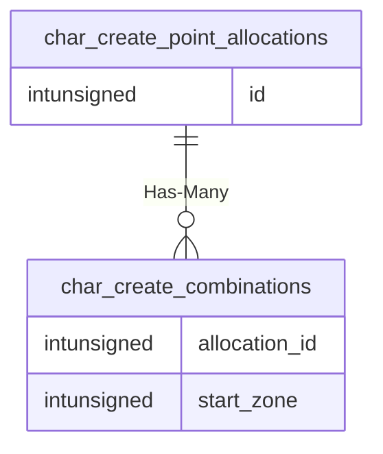

# char_create_point_allocations

## Relationships

| Relationship Type | Local Key | Relates to Table | Foreign Key |
| :--- | :--- | :--- | :--- |
| Has-Many | id | [char_create_combinations](../../schema/characters/char_create_combinations.md) | allocation_id |

## Schema

| Column | Data Type | Description |
| :--- | :--- | :--- |
| id | int | Allocation Identifier |
| base_str | int | Base Strength |
| base_sta | int | Base Stamina |
| base_dex | int | Base Dexterity |
| base_agi | int | Base Agility |
| base_int | int | Base Intelligence |
| base_wis | int | Base Wisdom |
| base_cha | int | Base Charisma |
| alloc_str | int | Allocated Strength |
| alloc_sta | int | Allocated Stamina |
| alloc_dex | int | Allocated Dexterity |
| alloc_agi | int | Allocated Agility |
| alloc_int | int | Allocated Intelligence |
| alloc_wis | int | Allocated Wisdom |
| alloc_cha | int | Allocated Charisma |

