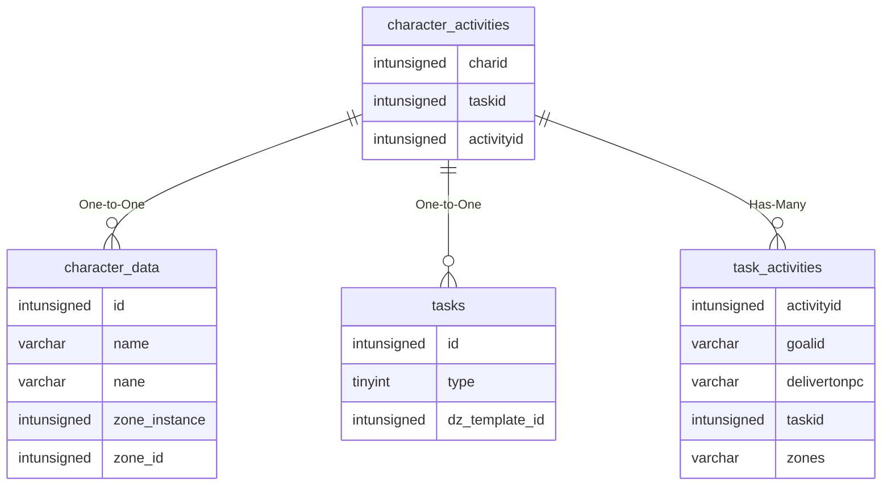

# character_activities

## Relationships

| Relationship Type | Local Key | Relates to Table | Foreign Key |
| :--- | :--- | :--- | :--- |
| One-to-One | charid | [character_data](../../schema/characters/character_data.md) | id |
| One-to-One | taskid | [tasks](../../schema/tasks/tasks.md) | id |
| Has-Many | activityid | [task_activities](../../schema/tasks/task_activities.md) | activityid |

## Schema

| Column | Data Type | Description |
| :--- | :--- | :--- |
| charid | int | [Character Identifier](character_data.md) |
| taskid | int | [Task Identifier](../../schema/tasks/tasks.md) |
| activityid | int | [Activity Identifier](../../schema/tasks/task_activities.md) |
| donecount | int | Done Count |
| completed | tinyint | Completed: 0 = False, 1 = True |

