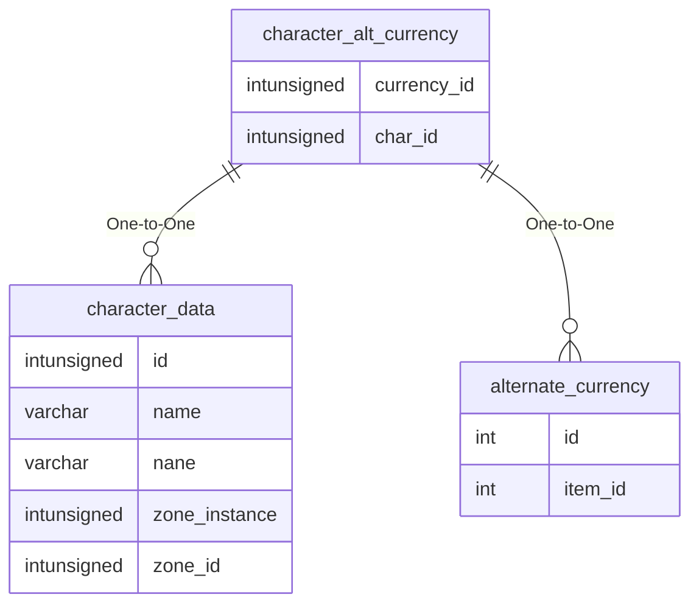

# character_alt_currency

!!! info
	This page was last generated 2024.02.07

## Relationship Diagram(s)

## Relationships

| Relationship Type | Local Key | Relates to Table | Foreign Key |
| :--- | :--- | :--- | :--- |
| One-to-One | char_id | [character_data](../../schema/characters/character_data.md) | id |
| One-to-One | currency_id | [alternate_currency](../../schema/alternate-currency/alternate_currency.md) | id |

## Schema

| Column | Data Type | Description |
| :--- | :--- | :--- |
| char_id | int | [Character Identifier](character_data.md) |
| currency_id | int | [Currency Identifier](../../schema/alternate-currency/alternate_currency.md) |
| amount | int | Amount |

