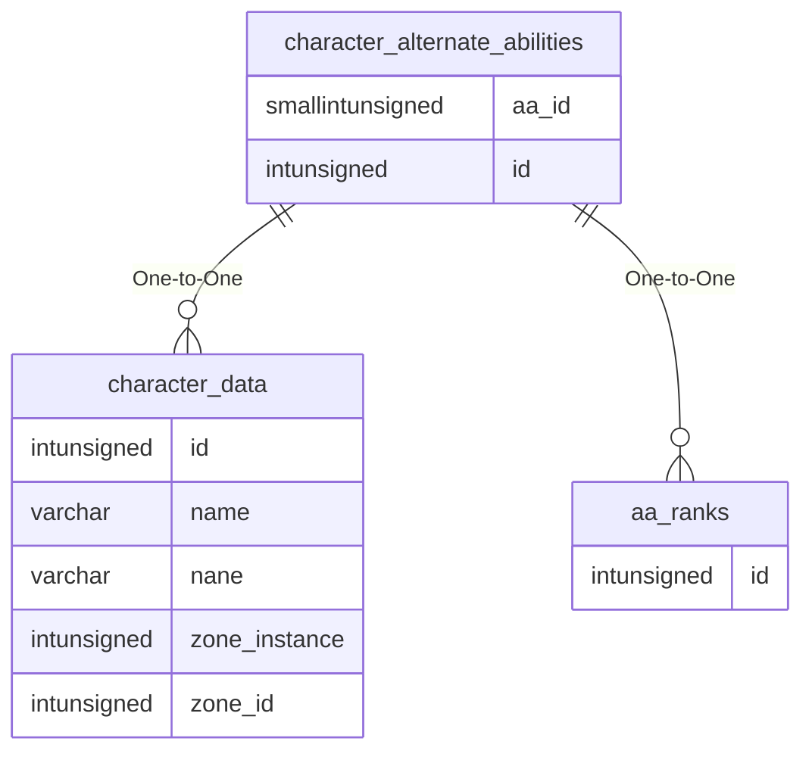

# character_alternate_abilities

!!! info
	This page was last generated 2024.02.07

## Relationship Diagram(s)

## Relationships

| Relationship Type | Local Key | Relates to Table | Foreign Key |
| :--- | :--- | :--- | :--- |
| One-to-One | id | [character_data](../../schema/characters/character_data.md) | id |
| One-to-One | aa_id | [aa_ranks](../../schema/aas/aa_ranks.md) | id |

## Schema

| Column | Data Type | Description |
| :--- | :--- | :--- |
| id | int | [Character Identifier](character_data.md) |
| aa_id | smallint | [AA Identifier](../../schema/aas/aa_ability.md) |
| aa_value | smallint | AA Value |
| charges | smallint | Charges |

