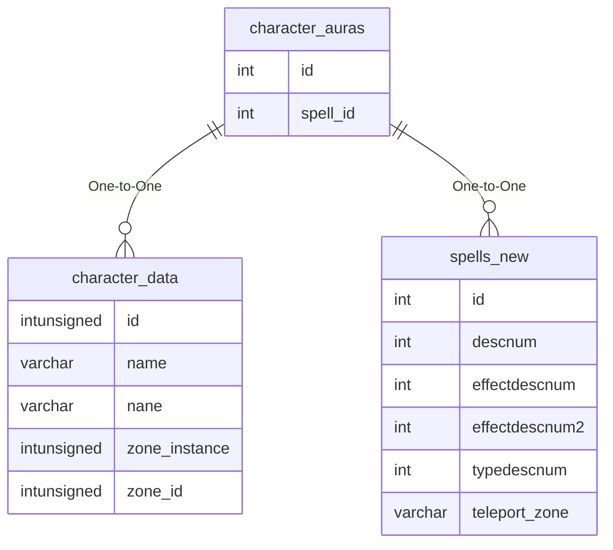

# character_auras

## Relationships

| Relationship Type | Local Key | Relates to Table | Foreign Key |
| :--- | :--- | :--- | :--- |
| One-to-One | id | [character_data](../../schema/characters/character_data.md) | id |
| One-to-One | spell_id | [spells_new](../../schema/spells/spells_new.md) | id |

## Schema

| Column | Data Type | Description |
| :--- | :--- | :--- |
| id | int | [Unique Character Identifier](character_data.md) |
| slot | tinyint | Slot |
| spell_id | int | [Spell Identifier](../../schema/spells/spells_new.md) |

