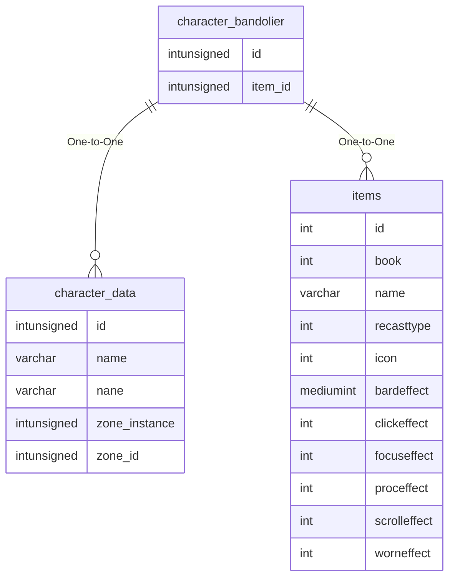

# character_bandolier

## Relationships

| Relationship Type | Local Key | Relates to Table | Foreign Key |
| :--- | :--- | :--- | :--- |
| One-to-One | id | [character_data](../../schema/characters/character_data.md) | id |
| One-to-One | item_id | [items](../../schema/items/items.md) | id |

## Schema

| Column | Data Type | Description |
| :--- | :--- | :--- |
| id | int | [Character Identifier](character_data.md) |
| bandolier_id | tinyint | Bandolier Identifier |
| bandolier_slot | tinyint | Slot |
| item_id | int | [Item Identifier](../../schema/items/items.md) |
| icon | int | Icon |
| bandolier_name | varchar | Name |

