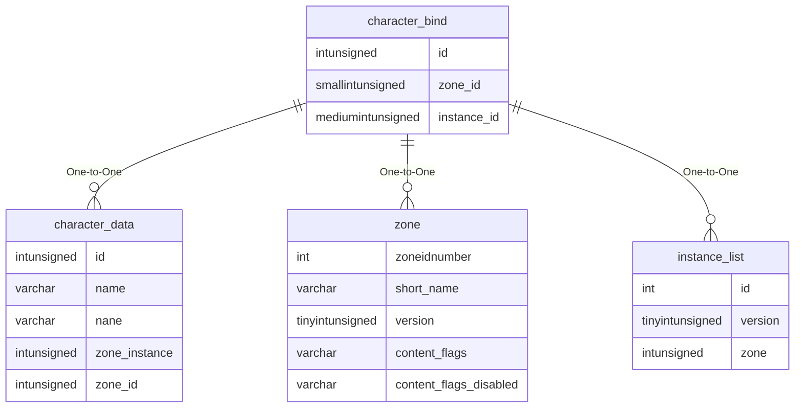

# character_bind

!!! info
	This page was last generated 2024.02.07

## Relationship Diagram(s)

## Relationships

| Relationship Type | Local Key | Relates to Table | Foreign Key |
| :--- | :--- | :--- | :--- |
| One-to-One | id | [character_data](../../schema/characters/character_data.md) | id |
| One-to-One | zone_id | [zone](../../schema/zone/zone.md) | zoneidnumber |
| One-to-One | instance_id | [instance_list](../../schema/instances/instance_list.md) | id |

## Schema

| Column | Data Type | Description |
| :--- | :--- | :--- |
| id | int | [Character Identifier](character_data.md) |
| slot | int | Slot |
| zone_id | smallint | [Zone Identifier](../../../../server/zones/zone-list) |
| instance_id | mediumint | Instance Identifier |
| x | float | X Coordinate |
| y | float | Y Coordinate |
| z | float | Z Coordinate |
| heading | float | Heading Coordinate |

