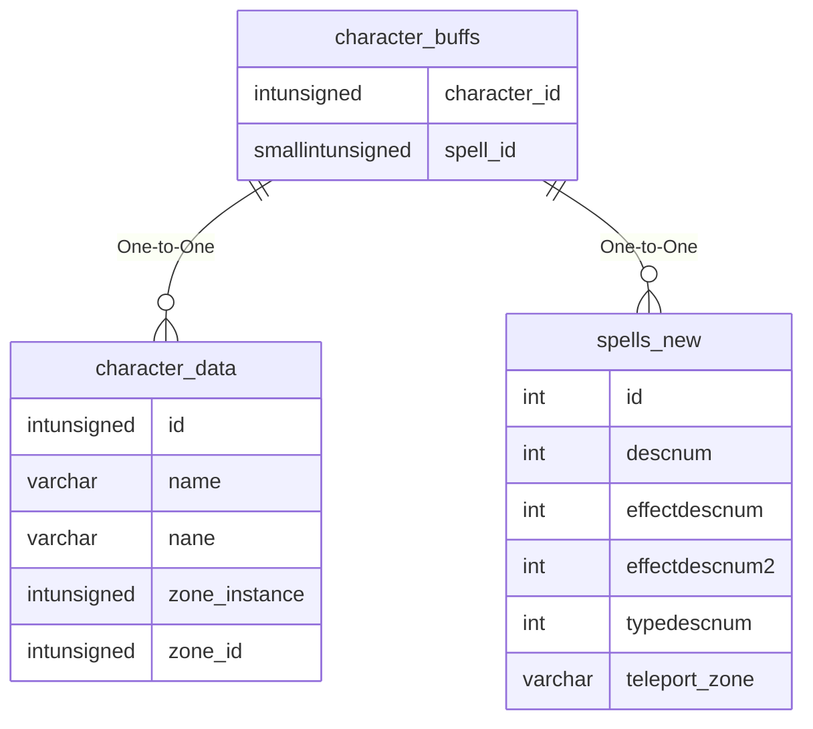

# character_buffs

!!! info
	This page was last generated 2024.02.07

## Relationship Diagram(s)

## Relationships

| Relationship Type | Local Key | Relates to Table | Foreign Key |
| :--- | :--- | :--- | :--- |
| One-to-One | character_id | [character_data](../../schema/characters/character_data.md) | id |
| One-to-One | spell_id | [spells_new](../../schema/spells/spells_new.md) | id |

## Schema

| Column | Data Type | Description |
| :--- | :--- | :--- |
| character_id | int | [Character Identifier](../../schema/characters/character_data.md) |
| slot_id | tinyint | Buff Slot |
| spell_id | smallint | [Buff Spell Identifier](../../schema/spells/spells_new.md) |
| caster_level | tinyint | Caster Level |
| caster_name | varchar | Caster Name |
| ticsremaining | int | Tics Remaining |
| counters | int | Counters |
| numhits | int | Number of Hits |
| melee_rune | int | Melee Rune |
| magic_rune | int | Magic Rune |
| persistent | tinyint | Persistent: 0 = False, 1 = True |
| dot_rune | int | Damage Over Time Rune |
| caston_x | int | X Coordinate |
| caston_y | int | Y Coordinate |
| caston_z | int | Z Coordinate |
| ExtraDIChance | int | Extra DI Chance |
| instrument_mod | int | Instrument Modifier |

