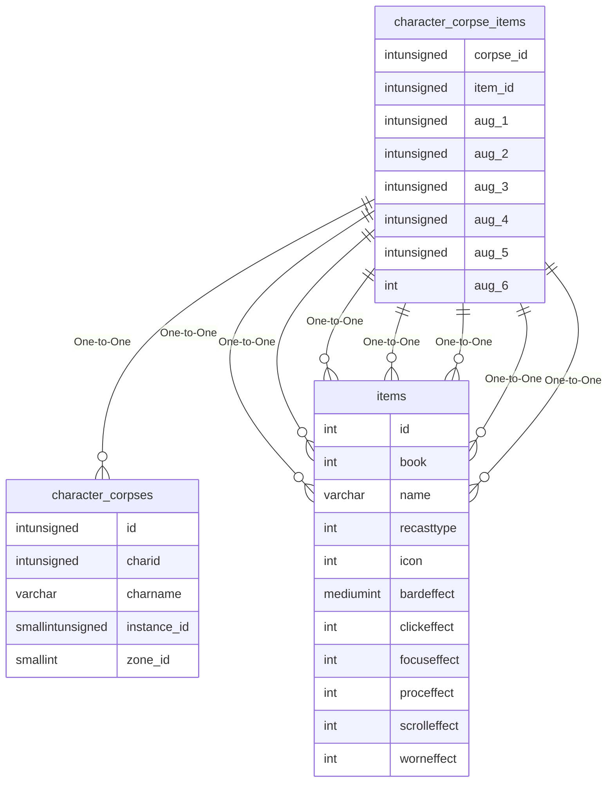

# character_corpse_items

!!! info
	This page was last generated 2024.02.07

## Relationship Diagram(s)

## Relationships

| Relationship Type | Local Key | Relates to Table | Foreign Key |
| :--- | :--- | :--- | :--- |
| One-to-One | corpse_id | [character_corpses](../../schema/characters/character_corpses.md) | id |
| One-to-One | item_id | [items](../../schema/items/items.md) | id |
| One-to-One | aug_1 | [items](../../schema/items/items.md) | id |
| One-to-One | aug_2 | [items](../../schema/items/items.md) | id |
| One-to-One | aug_3 | [items](../../schema/items/items.md) | id |
| One-to-One | aug_4 | [items](../../schema/items/items.md) | id |
| One-to-One | aug_5 | [items](../../schema/items/items.md) | id |
| One-to-One | aug_6 | [items](../../schema/items/items.md) | id |

## Schema

| Column | Data Type | Description |
| :--- | :--- | :--- |
| corpse_id | int | [Corpse Identifier](character_corpses.md) |
| equip_slot | int | Equipment Slot |
| item_id | int | [Item Identifier](../../schema/items/items.md) |
| charges | int | Item Charges |
| aug_1 | int | Item Augment Slot 1 |
| aug_2 | int | Item Augment Slot 2 |
| aug_3 | int | Item Augment Slot 3 |
| aug_4 | int | Item Augment Slot 4 |
| aug_5 | int | Item Augment Slot 5 |
| aug_6 | int | Item Augment Slot 6 |
| attuned | smallint | Item Attuned: 0 = False, 1 = True |
| custom_data | text | Custom Data |
| ornamenticon | int | Ornamentation Icon |
| ornamentidfile | int | Ornamentation IDFile |
| ornament_hero_model | int | Ornamentation Hero's Forge Model |

