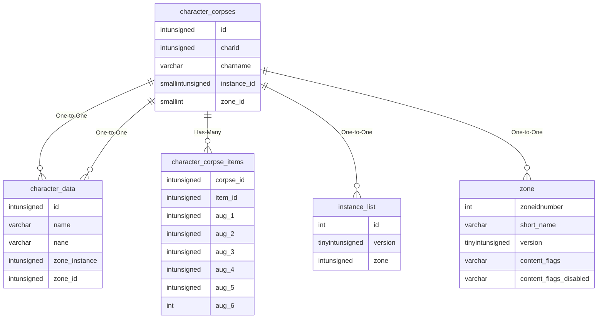

# character_corpses

## Relationships

| Relationship Type | Local Key | Relates to Table | Foreign Key |
| :--- | :--- | :--- | :--- |
| One-to-One | charid | [character_data](../../schema/characters/character_data.md) | id |
| One-to-One | charname | [character_data](../../schema/characters/character_data.md) | name |
| Has-Many | id | [character_corpse_items](../../schema/characters/character_corpse_items.md) | corpse_id |
| One-to-One | instance_id | [instance_list](../../schema/instances/instance_list.md) | id |
| One-to-One | zone_id | [zone](../../schema/zone/zone.md) | zoneidnumber |

## Schema

| Column | Data Type | Description |
| :--- | :--- | :--- |
| id | int | Unique Corpse Identifier |
| charid | int | [Character Identifier](character_data.md) |
| charname | varchar | Character Name |
| zone_id | smallint | [Zone Identifier](../../../../server/zones/zone-list) |
| instance_id | smallint | Instance Identifier |
| x | float | X Coordinate |
| y | float | Y Coordinate |
| z | float | Z Coordinate |
| heading | float | Heading Coordinate |
| time_of_death | datetime | Time of Death |
| guild_consent_id | int | Guild Consent Identifier |
| is_rezzed | tinyint | Is Rezzed: 0 = False, 1 = True |
| is_buried | tinyint | Is Buried: 0 = False, 1 = True |
| was_at_graveyard | tinyint | Was At Graveyard: 0 = False, 1 = True |
| is_locked | tinyint | Is Locked: 0 = False, 1 = True |
| exp | int | Experience |
| size | int | Size |
| level | int | Level |
| race | int | [Race](../../../../server/npc/race-list) |
| gender | int | [Gender](../../../../server/npc/genders) |
| class | int | [Class](../../../../server/player/class-list) |
| deity | int | [Deity](../../../../server/player/deity-list) |
| texture | int | [Texture](../../../../server/npc/textures) |
| helm_texture | int | [Helm Texture](../../../../server/npc/textures) |
| copper | int | Copper |
| silver | int | Silver |
| gold | int | Gold |
| platinum | int | Platinum |
| hair_color | int | Hair Color |
| beard_color | int | Beard Color |
| eye_color_1 | int | Eye Color 1 |
| eye_color_2 | int | Eye Color 2 |
| hair_style | int | Hair Style |
| face | int | Face |
| beard | int | Beard |
| drakkin_heritage | int | Drakkin Heritage |
| drakkin_tattoo | int | Drakkin Tattoo |
| drakkin_details | int | Drakkin Details |
| wc_1 | int | Wear Change 1 |
| wc_2 | int | Wear Change 2 |
| wc_3 | int | Wear Change 3 |
| wc_4 | int | Wear Change 4 |
| wc_5 | int | Wear Change 5 |
| wc_6 | int | Wear Change 6 |
| wc_7 | int | Wear Change 7 |
| wc_8 | int | Wear Change 8 |
| wc_9 | int | Wear Change 9 |
| rez_time | int |  |
| gm_exp | int |  |
| killed_by | int |  |
| rezzable | tinyint |  |

