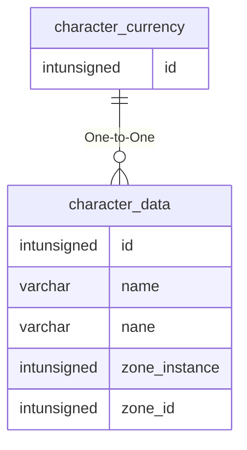

# character_currency

!!! info
	This page was last generated 2024.02.07

## Relationship Diagram(s)

## Relationships

| Relationship Type | Local Key | Relates to Table | Foreign Key |
| :--- | :--- | :--- | :--- |
| One-to-One | id | [character_data](../../schema/characters/character_data.md) | id |

## Schema

| Column | Data Type | Description |
| :--- | :--- | :--- |
| id | int | [Character Identifier](character_data.md) |
| platinum | int | Platinum |
| gold | int | Gold |
| silver | int | Silver |
| copper | int | Copper |
| platinum_bank | int | Banked Platinum |
| gold_bank | int | Banked Gold |
| silver_bank | int | Banked Silver |
| copper_bank | int | Banked Copper |
| platinum_cursor | int | Cursor Platinum |
| gold_cursor | int | Cursor Gold |
| silver_cursor | int | Cursor Silver |
| copper_cursor | int | Cursor Copper |
| radiant_crystals | int | Radiant Crystals |
| career_radiant_crystals | int | Career Radiant Crystals |
| ebon_crystals | int | Ebon Crystals |
| career_ebon_crystals | int | Career Ebon Crystals |

