# character_data

## Relationships

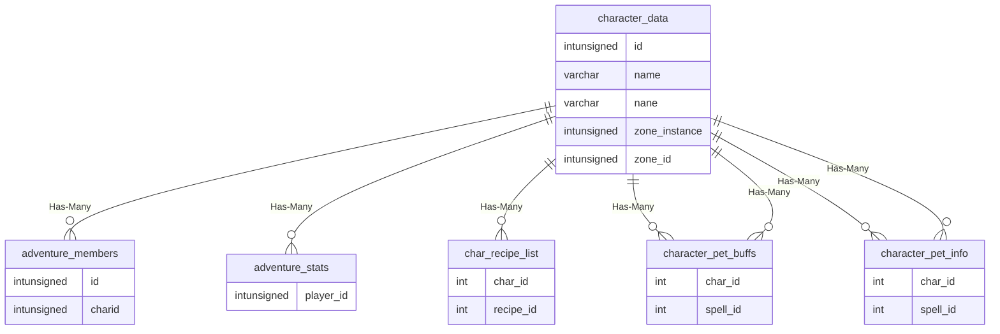

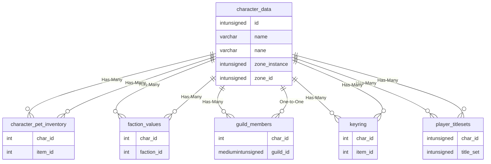

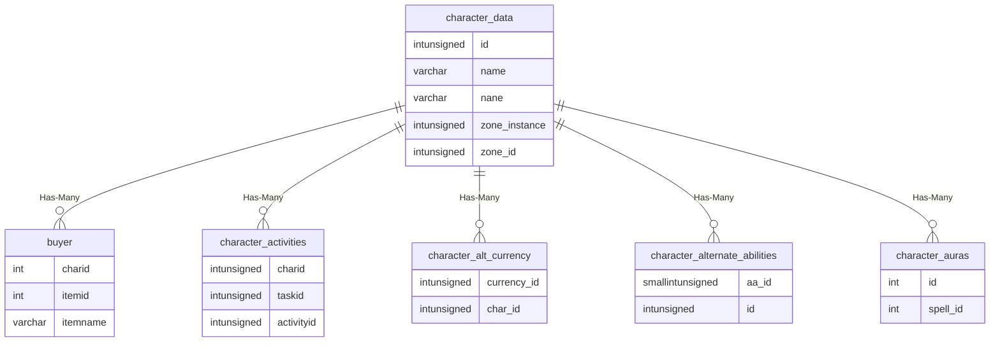

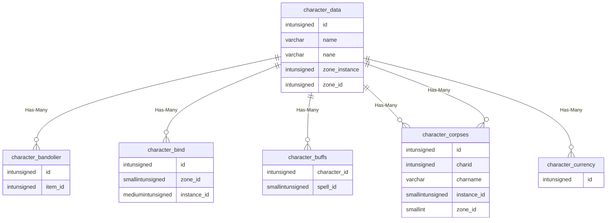

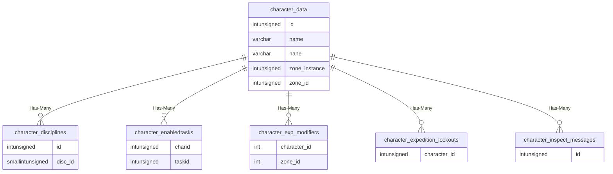

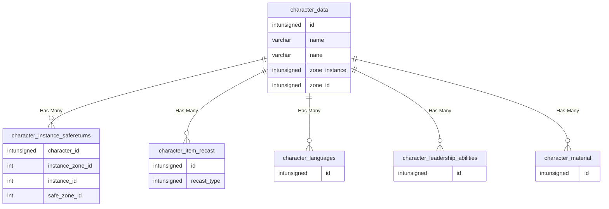

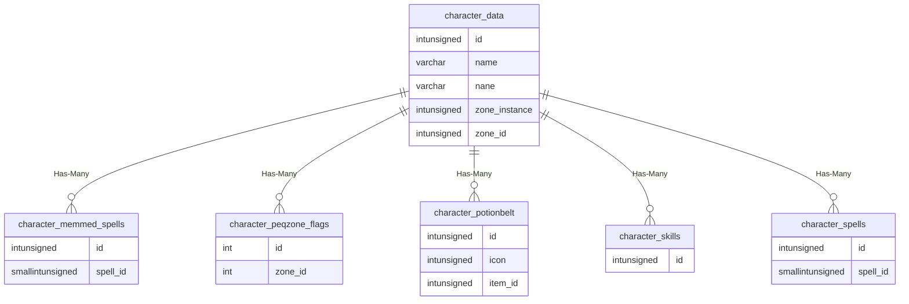

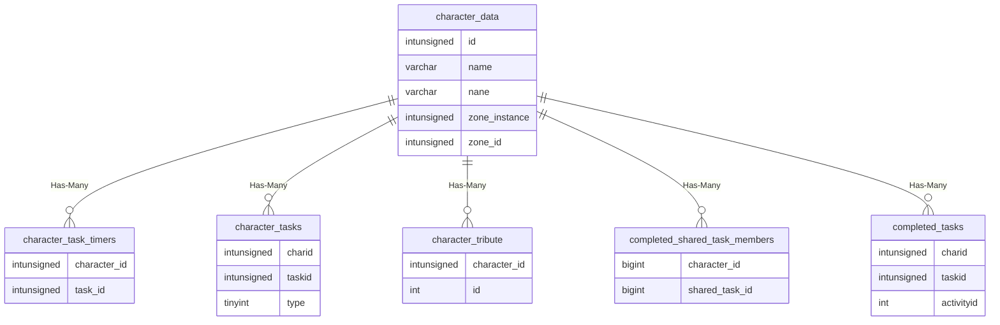

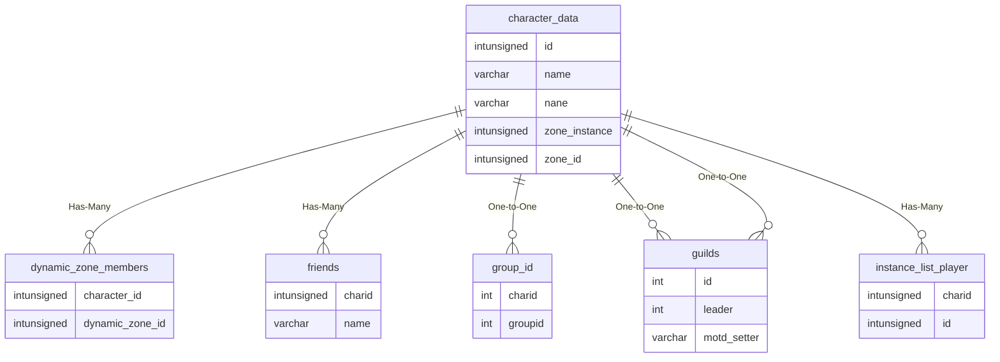

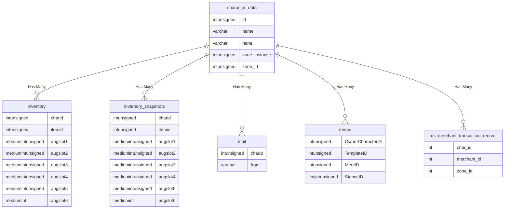

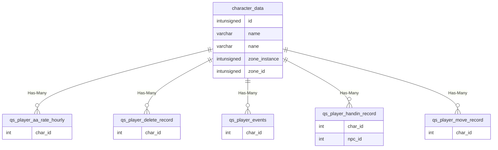

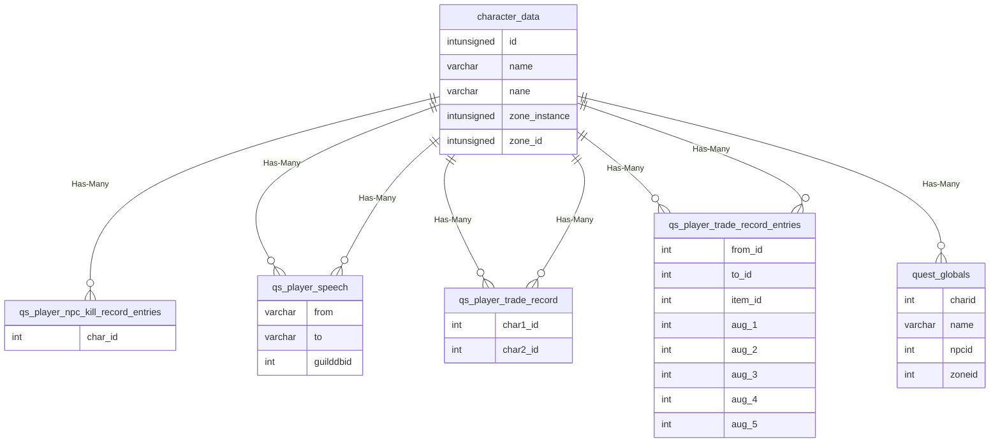

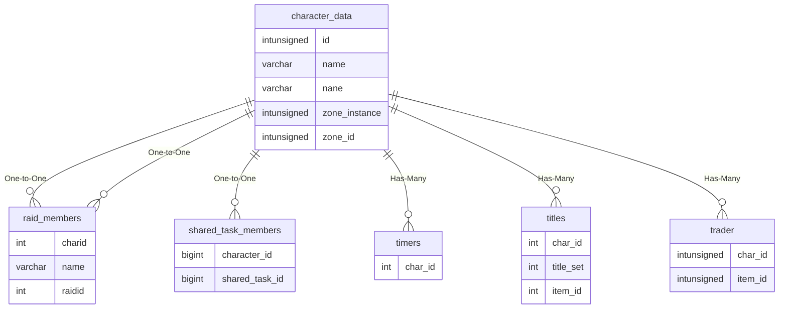

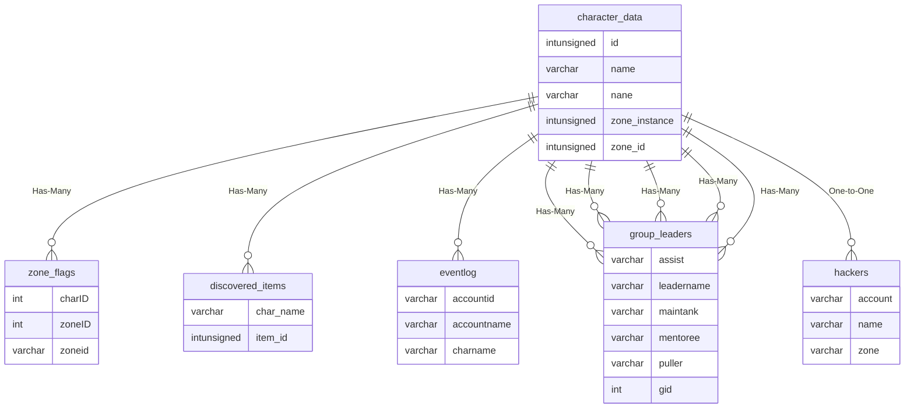

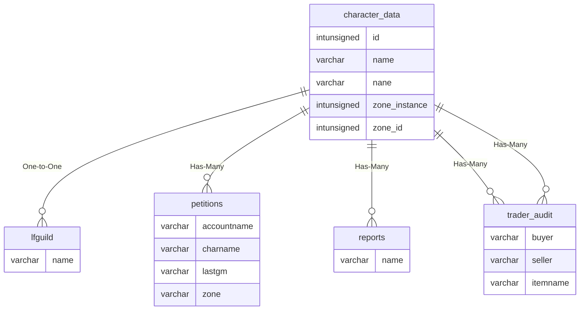

| Relationship Type | Local Key | Relates to Table | Foreign Key |
| :--- | :--- | :--- | :--- |
| Has-Many | id | [adventure_members](../../schema/adventures/adventure_members.md) | charid |
| Has-Many | id | [adventure_stats](../../schema/adventures/adventure_stats.md) | player_id |
| Has-Many | id | [char_recipe_list](../../schema/characters/char_recipe_list.md) | char_id |
| Has-Many | id | [character_pet_buffs](../../schema/characters/character_pet_buffs.md) | char_id |
| Has-Many | id | [character_pet_info](../../schema/characters/character_pet_info.md) | char_id |
| Has-Many | id | [character_pet_inventory](../../schema/characters/character_pet_inventory.md) | char_id |
| Has-Many | id | [faction_values](../../schema/factions/faction_values.md) | char_id |
| Has-Many | id | [guild_members](../../schema/views/vw_guild_members.md) | char_id |
| Has-Many | id | [keyring](../../schema/characters/keyring.md) | char_id |
| Has-Many | id | [player_titlesets](../../schema/characters/player_titlesets.md) | char_id |
| Has-Many | id | [buyer](../../schema/buyers/buyer.md) | charid |
| Has-Many | id | [character_activities](../../schema/characters/character_activities.md) | charid |
| Has-Many | id | [character_alt_currency](../../schema/characters/character_alt_currency.md) | char_id |
| Has-Many | id | [character_alternate_abilities](../../schema/characters/character_alternate_abilities.md) | id |
| Has-Many | id | [character_auras](../../schema/characters/character_auras.md) | id |
| Has-Many | id | [character_bandolier](../../schema/characters/character_bandolier.md) | id |
| Has-Many | id | [character_bind](../../schema/characters/character_bind.md) | id |
| Has-Many | id | [character_buffs](../../schema/characters/character_buffs.md) | character_id |
| Has-Many | id | [character_corpses](../../schema/characters/character_corpses.md) | charid |
| Has-Many | id | [character_currency](../../schema/characters/character_currency.md) | id |
| Has-Many | id | [character_disciplines](../../schema/characters/character_disciplines.md) | id |
| Has-Many | id | [character_enabledtasks](../../schema/characters/character_enabledtasks.md) | charid |
| Has-Many | id | [character_exp_modifiers](../../schema/characters/character_exp_modifiers.md) | character_id |
| Has-Many | id | [character_expedition_lockouts](../../schema/characters/character_expedition_lockouts.md) | character_id |
| Has-Many | id | [character_inspect_messages](../../schema/characters/character_inspect_messages.md) | id |
| Has-Many | id | [character_instance_safereturns](../../schema/characters/character_instance_safereturns.md) | character_id |
| Has-Many | id | [character_item_recast](../../schema/characters/character_item_recast.md) | id |
| Has-Many | id | [character_languages](../../schema/characters/character_languages.md) | id |
| Has-Many | id | [character_leadership_abilities](../../schema/characters/character_leadership_abilities.md) | id |
| Has-Many | id | [character_material](../../schema/characters/character_material.md) | id |
| Has-Many | id | [character_memmed_spells](../../schema/characters/character_memmed_spells.md) | id |
| Has-Many | id | [character_peqzone_flags](../../schema/characters/character_peqzone_flags.md) | id |
| Has-Many | id | [character_pet_buffs](../../schema/characters/character_pet_buffs.md) | char_id |
| Has-Many | id | [character_pet_info](../../schema/characters/character_pet_info.md) | char_id |
| Has-Many | id | [character_pet_inventory](../../schema/characters/character_pet_inventory.md) | char_id |
| Has-Many | id | [character_potionbelt](../../schema/characters/character_potionbelt.md) | id |
| Has-Many | id | [character_skills](../../schema/characters/character_skills.md) | id |
| Has-Many | id | [character_spells](../../schema/characters/character_spells.md) | id |
| Has-Many | id | [character_task_timers](../../schema/characters/character_task_timers.md) | character_id |
| Has-Many | id | [character_tasks](../../schema/characters/character_tasks.md) | charid |
| Has-Many | id | [character_tribute](../../schema/characters/character_tribute.md) | character_id |
| Has-Many | id | [completed_shared_task_members](../../schema/tasks/completed_shared_task_members.md) | character_id |
| Has-Many | id | [completed_tasks](../../schema/tasks/completed_tasks.md) | charid |
| Has-Many | id | [dynamic_zone_members](../../schema/dynamic-zones/dynamic_zone_members.md) | character_id |
| Has-Many | id | [faction_values](../../schema/factions/faction_values.md) | char_id |
| Has-Many | id | [friends](../../schema/characters/friends.md) | charid |
| One-to-One | id | [group_id](../../schema/groups/group_id.md) | charid |
| One-to-One | id | [guild_members](../../schema/views/vw_guild_members.md) | char_id |
| One-to-One | id | [guilds](../../schema/guilds/guilds.md) | leader |
| Has-Many | id | [instance_list_player](../../schema/instances/instance_list_player.md) | charid |
| Has-Many | id | [inventory](../../schema/mercenaries/merc_inventory.md) | charid |
| Has-Many | id | [inventory_snapshots](../../schema/inventory/inventory_snapshots.md) | charid |
| Has-Many | id | [keyring](../../schema/characters/keyring.md) | char_id |
| Has-Many | id | [mail](../../schema/characters/mail.md) | charid |
| Has-Many | id | [mercs](../../schema/mercenaries/mercs.md) | OwnerCharacterID |
| Has-Many | id | [player_titlesets](../../schema/characters/player_titlesets.md) | char_id |
| Has-Many | id | [qs_merchant_transaction_record](../../schema/query-server/qs_merchant_transaction_record.md) | char_id |
| Has-Many | id | [qs_player_aa_rate_hourly](../../schema/query-server/qs_player_aa_rate_hourly.md) | char_id |
| Has-Many | id | [qs_player_delete_record](../../schema/query-server/qs_player_delete_record.md) | char_id |
| Has-Many | id | [qs_player_events](../../schema/query-server/qs_player_events.md) | char_id |
| Has-Many | id | [qs_player_handin_record](../../schema/query-server/qs_player_handin_record.md) | char_id |
| Has-Many | id | [qs_player_move_record](../../schema/query-server/qs_player_move_record.md) | char_id |
| Has-Many | id | [qs_player_npc_kill_record_entries](../../schema/query-server/qs_player_npc_kill_record_entries.md) | char_id |
| Has-Many | id | [qs_player_speech](../../schema/query-server/qs_player_speech.md) | from |
| Has-Many | id | [qs_player_speech](../../schema/query-server/qs_player_speech.md) | to |
| Has-Many | id | [qs_player_trade_record](../../schema/query-server/qs_player_trade_record.md) | char1_id |
| Has-Many | id | [qs_player_trade_record](../../schema/query-server/qs_player_trade_record.md) | char2_id |
| Has-Many | id | [qs_player_trade_record_entries](../../schema/query-server/qs_player_trade_record_entries.md) | from_id |
| Has-Many | id | [qs_player_trade_record_entries](../../schema/query-server/qs_player_trade_record_entries.md) | to_id |
| Has-Many | id | [quest_globals](../../schema/data-storage/quest_globals.md) | charid |
| One-to-One | id | [raid_members](../../schema/raids/raid_members.md) | charid |
| One-to-One | id | [shared_task_members](../../schema/tasks/shared_task_members.md) | character_id |
| Has-Many | id | [timers](../../schema/timers/timers.md) | char_id |
| Has-Many | id | [titles](../../schema/titles/titles.md) | char_id |
| Has-Many | id | [trader](../../schema/trader/trader.md) | char_id |
| Has-Many | id | [zone_flags](../../schema/zone/zone_flags.md) | charID |
| Has-Many | name | [character_corpses](../../schema/characters/character_corpses.md) | charname |
| Has-Many | name | [discovered_items](../../schema/admin/discovered_items.md) | char_name |
| Has-Many | name | [eventlog](../../schema/admin/eventlog.md) | charname |
| Has-Many | name | [group_leaders](../../schema/groups/group_leaders.md) | assist |
| Has-Many | name | [group_leaders](../../schema/groups/group_leaders.md) | leadername |
| Has-Many | name | [group_leaders](../../schema/groups/group_leaders.md) | maintank |
| Has-Many | name | [group_leaders](../../schema/groups/group_leaders.md) | mentoree |
| Has-Many | name | [group_leaders](../../schema/groups/group_leaders.md) | puller |
| One-to-One | name | [guilds](../../schema/guilds/guilds.md) | motd_setter |
| One-to-One | name | [hackers](../../schema/admin/hackers.md) | name |
| One-to-One | nane | [lfguild](../../schema/characters/lfguild.md) | name |
| Has-Many | name | [petitions](../../schema/admin/petitions.md) | charname |
| One-to-One | name | [raid_members](../../schema/raids/raid_members.md) | name |
| Has-Many | name | [reports](../../schema/admin/reports.md) | name |
| Has-Many | name | [trader_audit](../../schema/trader/trader_audit.md) | buyer |
| Has-Many | name | [trader_audit](../../schema/trader/trader_audit.md) | seller |

## Schema

| Column | Data Type | Description |
| :--- | :--- | :--- |
| id | int | Unique Character Identifier |
| account_id | int | [Account Identifier](../../schema/account/account.md) |
| name | varchar | Name |
| last_name | varchar | Last Name |
| title | varchar | Title |
| suffix | varchar | Suffix |
| zone_id | int | [Zone Identifier](../../../../server/zones/zone-list) |
| zone_instance | int | Zone Instance Identifier |
| y | float | Y Coordinate |
| x | float | X Coordinate |
| z | float | Z Coordinate |
| heading | float | Heading Coordinate |
| gender | tinyint | [Gender](../../../../server/npc/genders) |
| race | smallint | [Race](../../../../server/npc/race-list) |
| class | tinyint | [Class](../../../../server/player/class-list) |
| level | int | Level |
| deity | int | [Deity](../../../../server/player/deity-list) |
| birthday | int | UNIX Timestamp of Birthday |
| last_login | int | UNIX Timestamp of Last Login |
| time_played | int | Time Played |
| level2 | tinyint | Level 2 |
| anon | tinyint | Anon: 0 = False, 1 = Anonymous, 2 = Roleplaying |
| gm | tinyint | GM: 0 = False, 1 = True |
| face | int | Face |
| hair_color | tinyint | Hair Color |
| hair_style | tinyint | Hair Style |
| beard | tinyint | Beard |
| beard_color | tinyint | Beard Color |
| eye_color_1 | tinyint | Eye Color 1 |
| eye_color_2 | tinyint | Eye Color 2 |
| drakkin_heritage | int | Drakkin Heritage |
| drakkin_tattoo | int | Drakkin Tattoo |
| drakkin_details | int | Drakkin Details |
| ability_time_seconds | tinyint | Ability Timer in Seconds |
| ability_number | tinyint | [Ability Number](../../schema/aas/aa_ability.md) |
| ability_time_minutes | tinyint | Ability Timer in Minutes |
| ability_time_hours | tinyint | Ability Timer in Hours |
| exp | int | Experience |
| exp_enabled | tinyint | Experience Enabled: 0 = False, 1 = True |
| aa_points_spent | int | AA Points Spent |
| aa_exp | int | AA Experience |
| aa_points | int | AA Points |
| group_leadership_exp | int | Group Leadership Experience |
| raid_leadership_exp | int | Raid Leadership Experience |
| group_leadership_points | int | Group Leadership Points |
| raid_leadership_points | int | Raid Leadership Points |
| points | int | Points |
| cur_hp | int | Health |
| mana | int | Mana |
| endurance | int | Endurance |
| intoxication | int | Intoxication |
| str | int | Strength |
| sta | int | Stamina |
| cha | int | Charisma |
| dex | int | Dexterity |
| int | int | Intelligence |
| agi | int | Agility |
| wis | int | Wisdom |
| zone_change_count | int | Zone Change Count |
| toxicity | int | Toxicity |
| hunger_level | int | Hunger Level |
| thirst_level | int | Thirst Level |
| ability_up | int | Ability Up |
| ldon_points_guk | int | LDoN Points - [Deepest Guk](../../../../server/zones/ldon-themes) |
| ldon_points_mir | int | LDoN Points - [Miragul's Menagerie](../../../../server/zones/ldon-themes) |
| ldon_points_mmc | int | LDoN Points - [Mistmoore Catacombs](../../../../server/zones/ldon-themes) |
| ldon_points_ruj | int | LDoN Points - [Rujarkian Hills](../../../../server/zones/ldon-themes) |
| ldon_points_tak | int | LDoN Points - [Takish-Hiz](../../../../server/zones/ldon-themes) |
| ldon_points_available | int | LDoN Points Available |
| tribute_time_remaining | int | Tribute Time Remaining |
| career_tribute_points | int | Career Tribute Points |
| tribute_points | int | Tribute Points |
| tribute_active | int | Tribute Active: 0 = False, 1 = True |
| pvp_status | tinyint | PVP Status: 0 = False, 1 = True |
| pvp_kills | int | PVP Kills |
| pvp_deaths | int | PVP Deaths |
| pvp_current_points | int | PVP Points |
| pvp_career_points | int | Career PVP Points |
| pvp_best_kill_streak | int | Best Kill Streak |
| pvp_worst_death_streak | int | Worse Death Streak |
| pvp_current_kill_streak | int | Current Kill Streak |
| pvp2 | int | PVP Status: 0 = False, 1 = True |
| pvp_type | int | PVP Type |
| show_helm | int | Show Helm: 0 = False, 1 = True |
| group_auto_consent | tinyint | Group Auto Consent: 0 = False, 1 = True |
| raid_auto_consent | tinyint | Raid Auto Consent: 0 = False, 1 = True |
| guild_auto_consent | tinyint | Guild Auto Consent: 0 = False, 1 = True |
| leadership_exp_on | tinyint | Leadership Experience On : 0 = False, 1 = True |
| RestTimer | int | Rest Timer |
| air_remaining | int | Air Remaining |
| autosplit_enabled | int | Autosplit Enabled: 0 = False, 1 = True |
| lfp | tinyint | Looking For Party: 0 = False, 1 = True |
| lfg | tinyint | Looking For Guild: 0 = False, 1 = True |
| mailkey | char | Mail Key |
| xtargets | tinyint | XTargets |
| firstlogon | tinyint | First Logon |
| e_aa_effects | int | Experience AA Effects |
| e_percent_to_aa | int | Experience Percentage to AA Points |
| e_expended_aa_spent | int | Expended AA Points Spent |
| aa_points_spent_old | int | AA Points Spent Old |
| aa_points_old | int | AA Points Old |
| e_last_invsnapshot | int | Last Inventory Snapshot |
| deleted_at | datetime | Deleted At Unix Timestamp |

