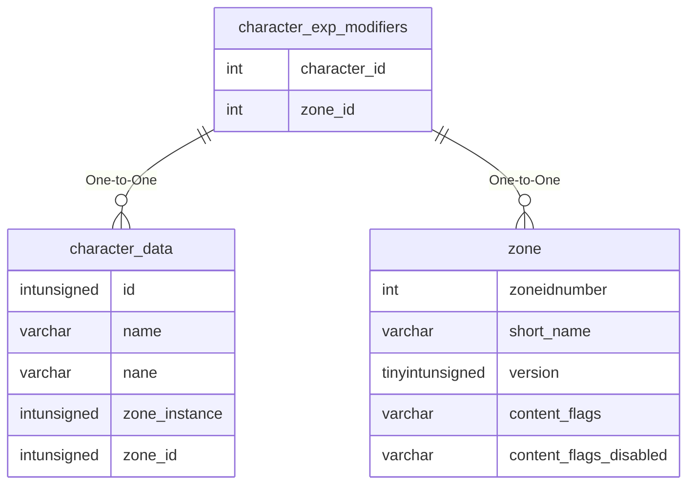

# character_exp_modifiers

!!! info
	This page was last generated 2024.02.07

## Relationship Diagram(s)

## Relationships

| Relationship Type | Local Key | Relates to Table | Foreign Key |
| :--- | :--- | :--- | :--- |
| One-to-One | character_id | [character_data](../../schema/characters/character_data.md) | id |
| One-to-One | zone_id | [zone](../../schema/zone/zone.md) | zoneidnumber |

## Schema

| Column | Data Type | Description |
| :--- | :--- | :--- |
| character_id | int | [Character Identifier](character_data.md) |
| zone_id | int | [Zone Identifier](../../../../server/zones/zone-list) (0 for Global) |
| instance_version | int | Instance Version |
| aa_modifier | float | AA Experience Modifier (.5 = 50%, 1 = 100%, 1.5 = 150%) |
| exp_modifier | float | Experience Modifier (.5 = 50%, 1 = 100%, 1.5 = 150%) |

