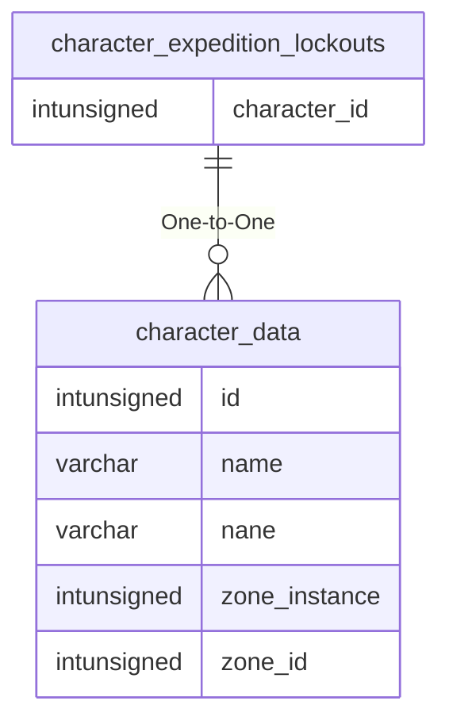

# character_expedition_lockouts

!!! info
	This page was last generated 2024.02.07

## Relationship Diagram(s)

## Relationships

| Relationship Type | Local Key | Relates to Table | Foreign Key |
| :--- | :--- | :--- | :--- |
| One-to-One | character_id | [character_data](../../schema/characters/character_data.md) | id |

## Schema

| Column | Data Type | Description |
| :--- | :--- | :--- |
| id | int | Lockout Identifier |
| character_id | int | [Character Identifier](../../schema/characters/character_data.md) |
| expedition_name | varchar | Expedition Name |
| event_name | varchar | Event Name |
| expire_time | datetime | Expire Time |
| duration | int | Duration in Seconds |
| from_expedition_uuid | varchar | From Expedition UUID |

