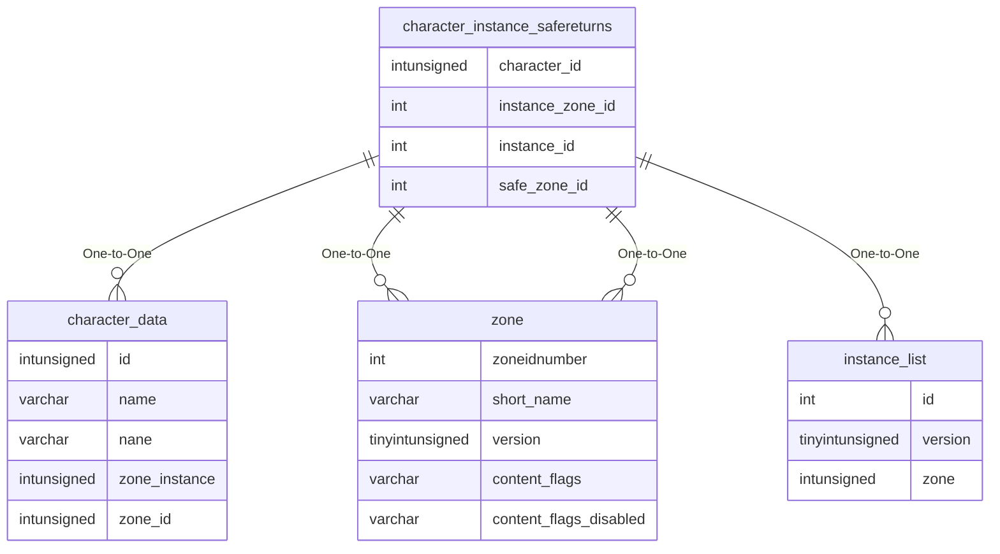

# character_instance_safereturns

## Relationships

| Relationship Type | Local Key | Relates to Table | Foreign Key |
| :--- | :--- | :--- | :--- |
| One-to-One | character_id | [character_data](../../schema/characters/character_data.md) | id |
| One-to-One | instance_zone_id | [zone](../../schema/zone/zone.md) | zoneidnumber |
| One-to-One | instance_id | [instance_list](../../schema/instances/instance_list.md) | id |
| One-to-One | safe_zone_id | [zone](../../schema/zone/zone.md) | zoneidnumber |

## Schema

| Column | Data Type | Description |
| :--- | :--- | :--- |
| id | int | Safe Return Identifier |
| character_id | int | [Character Identifier](character_data.md) |
| instance_zone_id | int | [Instance Zone Identifier](../../../../server/zones/zone-list) |
| instance_id | int | [Instance Identifier](../../schema/instances/instance_list.md) |
| safe_zone_id | int | [Save Zone Identifier](../../../../server/zones/zone-list) |
| safe_x | float | Safe X Coordinate |
| safe_y | float | Safe Y Coordinate |
| safe_z | float | Safe Z Coordinate |
| safe_heading | float | Safe Heading Coordinate |

