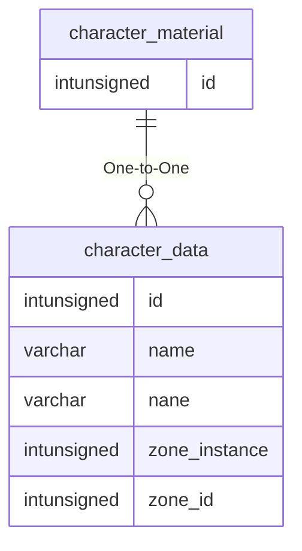

# character_material

## Relationships

| Relationship Type | Local Key | Relates to Table | Foreign Key |
| :--- | :--- | :--- | :--- |
| One-to-One | id | [character_data](../../schema/characters/character_data.md) | id |

## Schema

| Column | Data Type | Description |
| :--- | :--- | :--- |
| id | int | [Character Identifier](character_data.md) |
| slot | tinyint | Slot |
| blue | tinyint | Blue: 0 = None, 255 = Max |
| green | tinyint | Green: 0 = None, 255 = Max |
| red | tinyint | Red: 0 = None, 255 = Max |
| use_tint | tinyint | Tint: 0 = None, 255 = MAx |
| color | int | Color |

