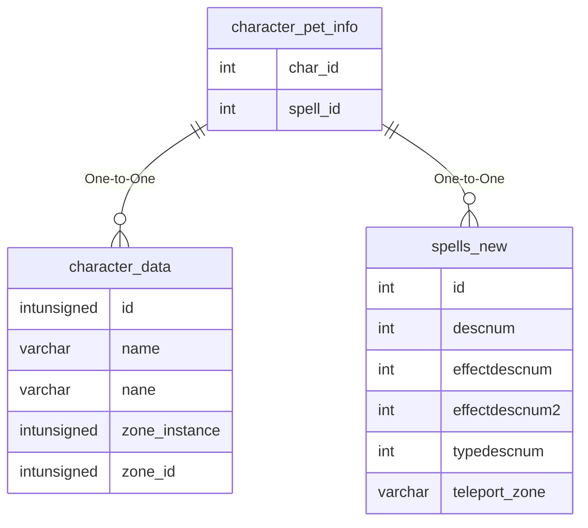

# character_pet_info

!!! info
	This page was last generated 2024.02.07

## Relationship Diagram(s)

## Relationships

| Relationship Type | Local Key | Relates to Table | Foreign Key |
| :--- | :--- | :--- | :--- |
| One-to-One | char_id | [character_data](../../schema/characters/character_data.md) | id |
| One-to-One | spell_id | [spells_new](../../schema/spells/spells_new.md) | id |

## Schema

| Column | Data Type | Description |
| :--- | :--- | :--- |
| char_id | int | [Character Identifier](character_data.md) |
| pet | int | Pet |
| petname | varchar | Pet Name |
| petpower | int | Pet Power |
| spell_id | int | [Spell Identifier](../../schema/spells/spells_new.md) |
| hp | int | Health |
| mana | int | Mana |
| size | float | Size |
| taunting | tinyint | Taunting: 0 = False, 1 = True |

