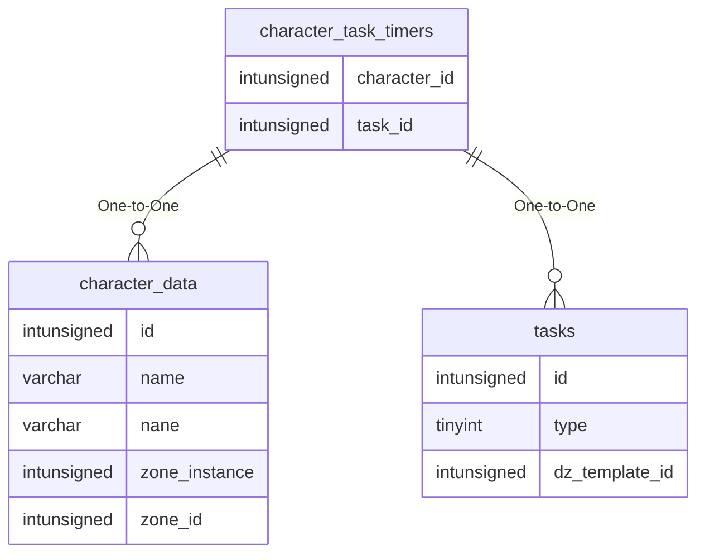

# character_task_timers

!!! info
	This page was last generated 2024.02.07

## Relationship Diagram(s)

## Relationships

| Relationship Type | Local Key | Relates to Table | Foreign Key |
| :--- | :--- | :--- | :--- |
| One-to-One | character_id | [character_data](../../schema/characters/character_data.md) | id |
| One-to-One | task_id | [tasks](../../schema/tasks/tasks.md) | id |

## Schema

| Column | Data Type | Description |
| :--- | :--- | :--- |
| id | int | Unique Task Timer Identifier |
| character_id | int | [Character Identifer](character_data.md) |
| task_id | int | [Task Identifier](../../schema/tasks/tasks.md) |
| timer_type | int | Timer Type (0 = Replay, 1 = Request) |
| timer_group | int | Group Timer |
| expire_time | datetime | Expire Time |

