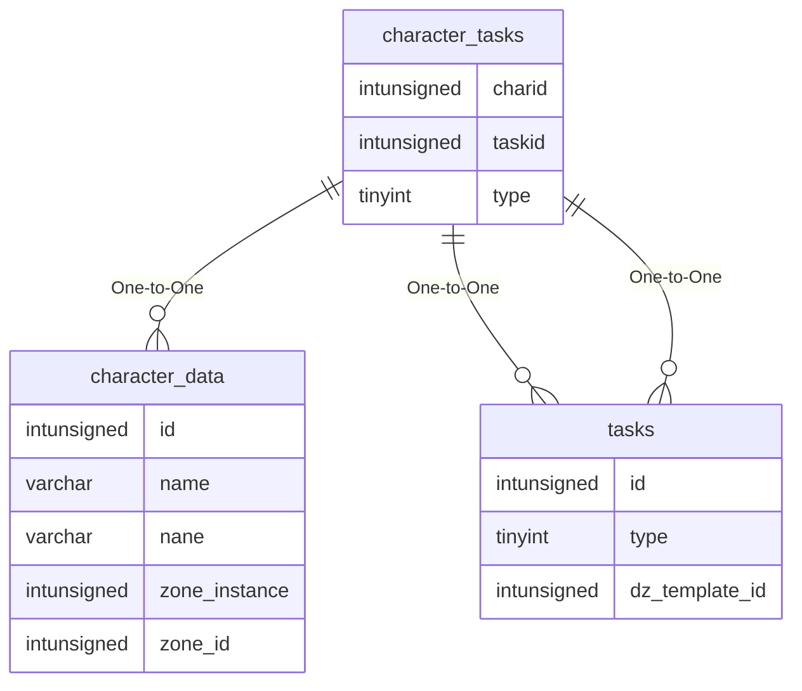

# character_tasks

!!! info
	This page was last generated 2024.02.07

## Relationship Diagram(s)

## Relationships

| Relationship Type | Local Key | Relates to Table | Foreign Key |
| :--- | :--- | :--- | :--- |
| One-to-One | charid | [character_data](../../schema/characters/character_data.md) | id |
| One-to-One | taskid | [tasks](../../schema/tasks/tasks.md) | id |
| One-to-One | type | [tasks](../../schema/tasks/tasks.md) | type |

## Schema

| Column | Data Type | Description |
| :--- | :--- | :--- |
| charid | int | [Character Identifier](character_data.md) |
| taskid | int | [Task Identifier](../../schema/tasks/tasks.md) |
| slot | int | Slot |
| type | tinyint | [Task Type](../../../../server/task-system-guide/task-types) |
| acceptedtime | int | Accepted Time UNIX Timestamp |
| was_rewarded | tinyint | Was Rewarded: 0 = False, 1 = True |

