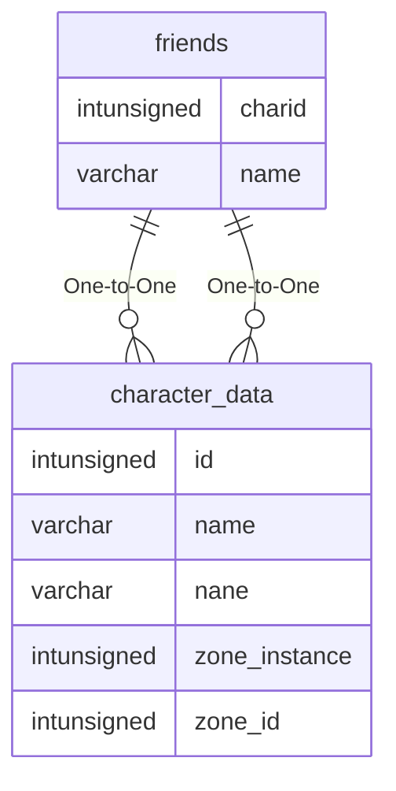

# friends

## Relationships

| Relationship Type | Local Key | Relates to Table | Foreign Key |
| :--- | :--- | :--- | :--- |
| One-to-One | charid | [character_data](../../schema/characters/character_data.md) | id |
| One-to-One | name | [character_data](../../schema/characters/character_data.md) | name |

## Schema

| Column | Data Type | Description |
| :--- | :--- | :--- |
| charid | int | [Character Identifier](character_data.md) |
| type | tinyint | Type: 0 = Ignore, 1 = Friend |
| name | varchar | [Friend Name](character_data.md) |

