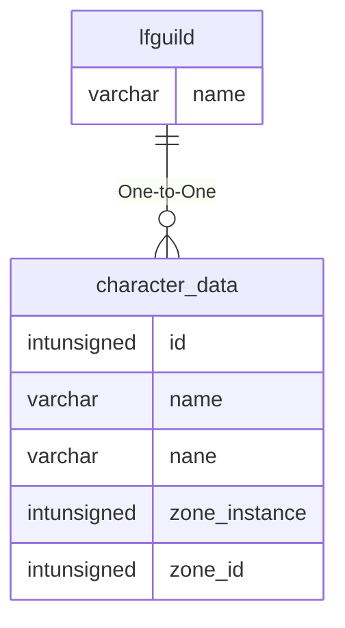

# lfguild

## Relationships

| Relationship Type | Local Key | Relates to Table | Foreign Key |
| :--- | :--- | :--- | :--- |
| One-to-One | name | [character_data](../../schema/characters/character_data.md) | name |

## Schema

| Column | Data Type | Description |
| :--- | :--- | :--- |
| type | tinyint | Type |
| name | varchar | Name |
| comment | varchar | Comment |
| fromlevel | tinyint | From Level |
| tolevel | tinyint | To Level |
| classes | int | [Classes](../../../../server/player/class-list) |
| aacount | int | AA Count |
| timezone | int | Time Zone |
| timeposted | int | Time Posted UNIX Timestamp |

