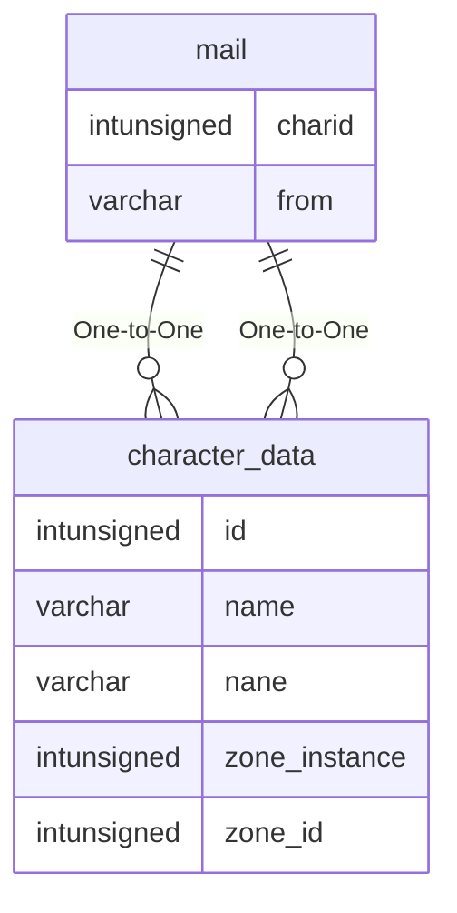

# mail

## Relationships

| Relationship Type | Local Key | Relates to Table | Foreign Key |
| :--- | :--- | :--- | :--- |
| One-to-One | charid | [character_data](../../schema/characters/character_data.md) | id |
| One-to-One | from | [character_data](../../schema/characters/character_data.md) | name |

## Schema

| Column | Data Type | Description |
| :--- | :--- | :--- |
| msgid | int | Unique Message Identifier |
| charid | int | [Character Identifier](character_data.md) |
| timestamp | int | UNIX Timestamp |
| from | varchar | [From Character Name](character_data.md) |
| subject | varchar | Subject |
| body | text | Body |
| to | text | [To Character Name](character_data.md) |
| status | tinyint | [Status](../../../../server/player/status-levels) |

