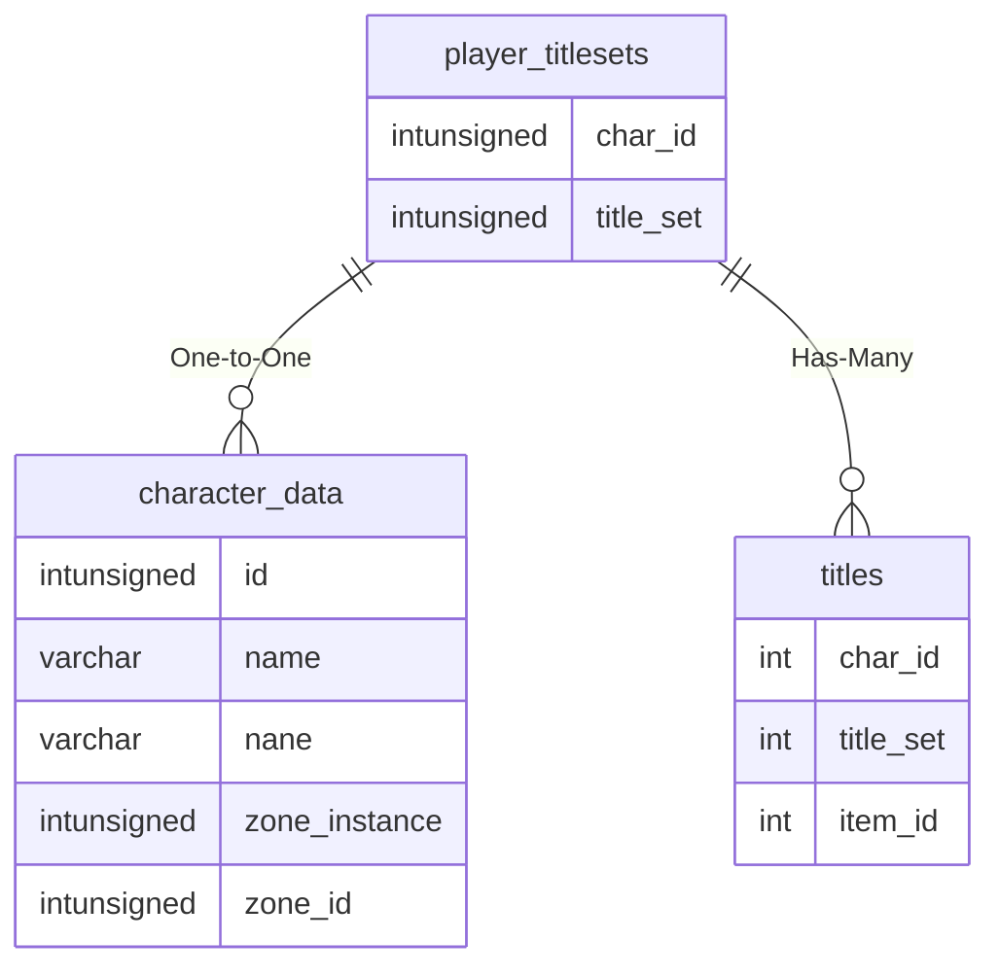

# player_titlesets

## Relationships

| Relationship Type | Local Key | Relates to Table | Foreign Key |
| :--- | :--- | :--- | :--- |
| One-to-One | char_id | [character_data](../../schema/characters/character_data.md) | id |
| Has-Many | title_set | [titles](../../schema/titles/titles.md) | title_set |

## Schema

| Column | Data Type | Description |
| :--- | :--- | :--- |
| id | int | Unique Title Set Identifier |
| char_id | int | [Character Identifier](character_data.md) |
| title_set | int | Title Set |

