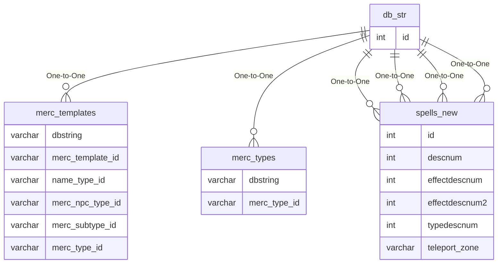

# db_str

## Relationships

| Relationship Type | Local Key | Relates to Table | Foreign Key |
| :--- | :--- | :--- | :--- |
| One-to-One | id | [merc_templates](../../schema/mercenaries/merc_templates.md) | dbstring |
| One-to-One | id | [merc_types](../../schema/mercenaries/merc_types.md) | dbstring |
| One-to-One | id | [spells_new](../../schema/spells/spells_new.md) | descnum |
| One-to-One | id | [spells_new](../../schema/spells/spells_new.md) | effectdescnum |
| One-to-One | id | [spells_new](../../schema/spells/spells_new.md) | effectdescnum2 |
| One-to-One | id | [spells_new](../../schema/spells/spells_new.md) | typedescnum |

## Schema

| Column | Data Type | Description |
| :--- | :--- | :--- |
| id | int | Unique Database String Identifier |
| type | int | Type |
| value | text | Value |

