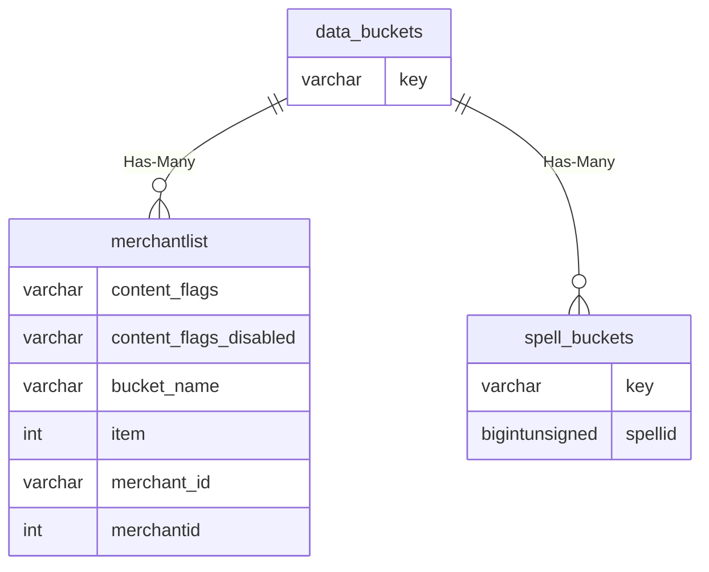

# data_buckets

## Relationships

| Relationship Type | Local Key | Relates to Table | Foreign Key |
| :--- | :--- | :--- | :--- |
| Has-Many | key | [merchantlist](../../schema/merchants/merchantlist.md) | bucket_name |
| Has-Many | key | [spell_buckets](../../schema/spells/spell_buckets.md) | key |

## Schema

| Column | Data Type | Description |
| :--- | :--- | :--- |
| id | bigint | Unique Data Bucket Identifier |
| key | varchar | Key |
| value | text | Value |
| expires | int | Expiration UNIX Timestamp |
| character_id | bigint |  |
| npc_id | bigint |  |
| bot_id | bigint |  |

