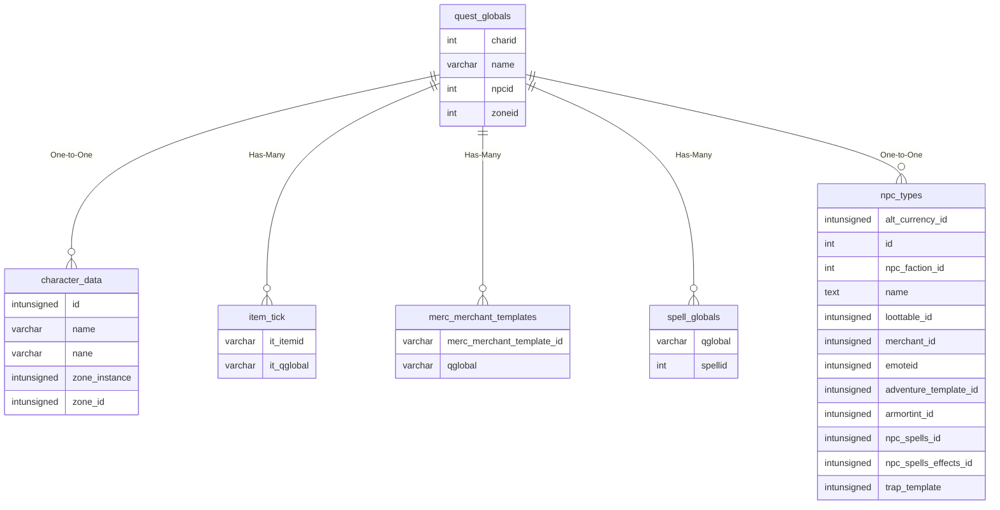
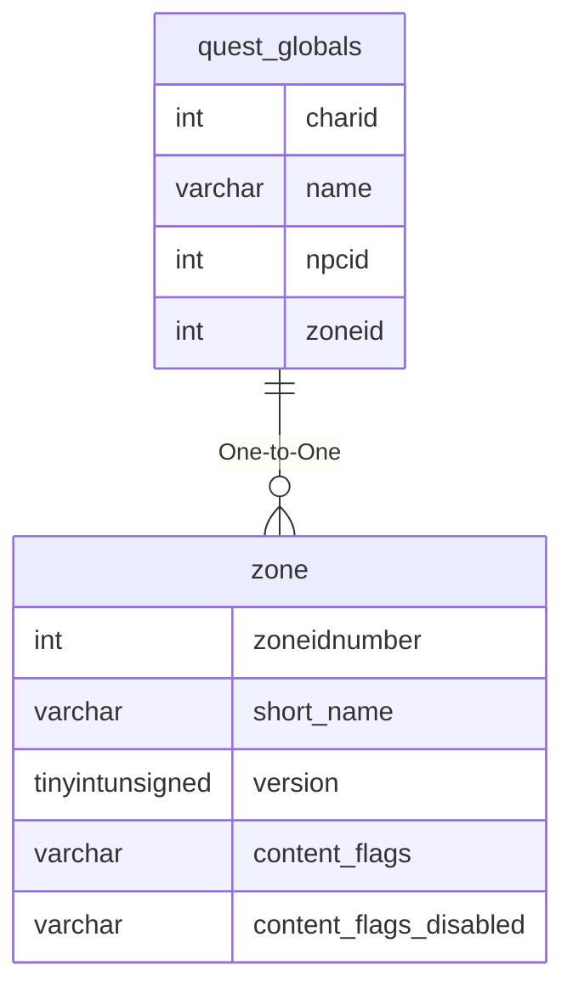

# quest_globals

!!! info
	This page was last generated 2024.02.07

## Relationship Diagram(s)

## Relationships

| Relationship Type | Local Key | Relates to Table | Foreign Key |
| :--- | :--- | :--- | :--- |
| One-to-One | charid | [character_data](../../schema/characters/character_data.md) | id |
| Has-Many | name | [item_tick](../../schema/items/item_tick.md) | it_qglobal |
| Has-Many | name | [merc_merchant_templates](../../schema/mercenaries/merc_merchant_templates.md) | qglobal |
| Has-Many | name | [spell_globals](../../schema/spells/spell_globals.md) | qglobal |
| One-to-One | npcid | [npc_types](../../schema/npcs/npc_types.md) | id |
| One-to-One | zoneid | [zone](../../schema/zone/zone.md) | zoneidnumber |

## Schema

| Column | Data Type | Description |
| :--- | :--- | :--- |
| charid | int | [Character Identifier](../../schema/characters/character_data.md) |
| npcid | int | [NPC Type Identifier](../../schema/npcs/npc_types.md) |
| zoneid | int | [Zone Identifier](../../../../server/zones/zone-list) |
| name | varchar | Name |
| value | varchar | Value |
| expdate | int | Expiration Date UNIX Timestamp |

