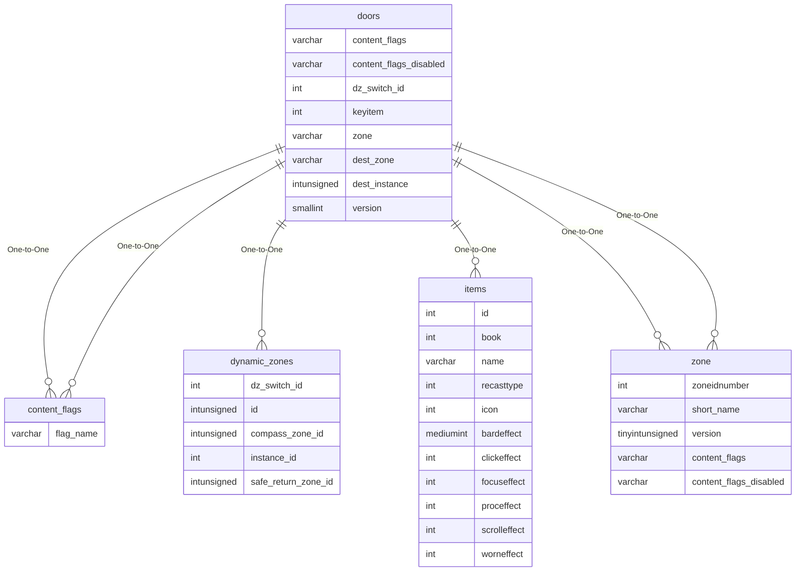

# doors

## Relationships

| Relationship Type | Local Key | Relates to Table | Foreign Key |
| :--- | :--- | :--- | :--- |
| One-to-One | content_flags | [content_flags](../../schema/flagging/content_flags.md) | flag_name |
| One-to-One | content_flags_disabled | [content_flags](../../schema/flagging/content_flags.md) | flag_name |
| One-to-One | dz_switch_id | [dynamic_zones](../../schema/tasks/shared_task_dynamic_zones.md) | dz_switch_id |
| One-to-One | keyitem | [items](../../schema/items/items.md) | id |
| One-to-One | zone | [zone](../../schema/zone/zone.md) | short_name |
| One-to-One | dest_zone | [zone](../../schema/zone/zone.md) | short_name |

## Schema

| Column | Data Type | Description |
| :--- | :--- | :--- |
| id | int | Unique Entry Identifier |
| doorid | smallint | Unique Door Identifier |
| zone | varchar | [Zone Short Name](../../../../server/zones/zone-list) |
| version | smallint | Zone Version: -1 For All |
| name | varchar | This is the name of the door, such as 'IT11161' or 'POPCREATE501', for names of objects you can see. |
| pos_y | float | Door Y Coordinate |
| pos_x | float | Door X Coordinate |
| pos_z | float | Door Z Coordinate |
| heading | float | Door Heading Coordinate |
| opentype | smallint | [Door Open Type](../../../../server/zones/door-open-types) |
| guild | smallint | [Guild Identifier](../../schema/guilds/guilds.md) |
| lockpick | smallint | Lockpicking Skill Required: -1 = Unpickable |
| keyitem | int | [Item Identifier](../../schema/items/items.md) |
| nokeyring | tinyint | No Key Ring: 0 = False, 1 = True |
| triggerdoor | smallint | Trigger Door: 0 For Current Door or use a Unique Door Identifier |
| triggertype | smallint | Trigger Type: 1 = Open a Type 255 door, 255 = Will Not Open |
| disable_timer | tinyint | Disable Timer |
| doorisopen | smallint | Door Is Open: 0 = False, 1 = True |
| door_param | int | Door Parameter |
| dest_zone | varchar | [Zone Short Name](../../../../server/zones/zone-list) |
| dest_instance | int | [Destination Instance](../../schema/instances/instance_list.md) |
| dest_x | float | Destination X Coordinate |
| dest_y | float | Destination Y Coordinate |
| dest_z | float | Destination Z Coordinate |
| dest_heading | float | Destination Heading Coordinate |
| invert_state | int | This column will basically behave like such: if the door has a click type and it is to raise up like a door, it will be raised on spawn of the door. Meaning it is inverted. Another example: If a [Door Open Type](../../../../server/zones/door-open-types) is set to a spinning object on click, you could set this to 1 to have the door be spinning on spawn. |
| incline | int | Incline |
| size | smallint | Size |
| buffer | float | Unused |
| client_version_mask | int | [Client Version Mask](../../../../server/player/client-version-bitmasks) |
| is_ldon_door | smallint | Is LDoN Door: 0 = False, 1 = True |
| dz_switch_id | int | [Dynamic Zone Switch Identifier](../../schema/dynamic-zones/dynamic_zones.md) |
| min_expansion | tinyint | Minimum Expansion](../../../../server/operation/expansion-list) |
| max_expansion | tinyint | Maximum Expansion](../../../../server/operation/expansion-list) |
| content_flags | varchar | Content Flags Required to be Enabled |
| content_flags_disabled | varchar | Content Flags Required to be Disabled |

