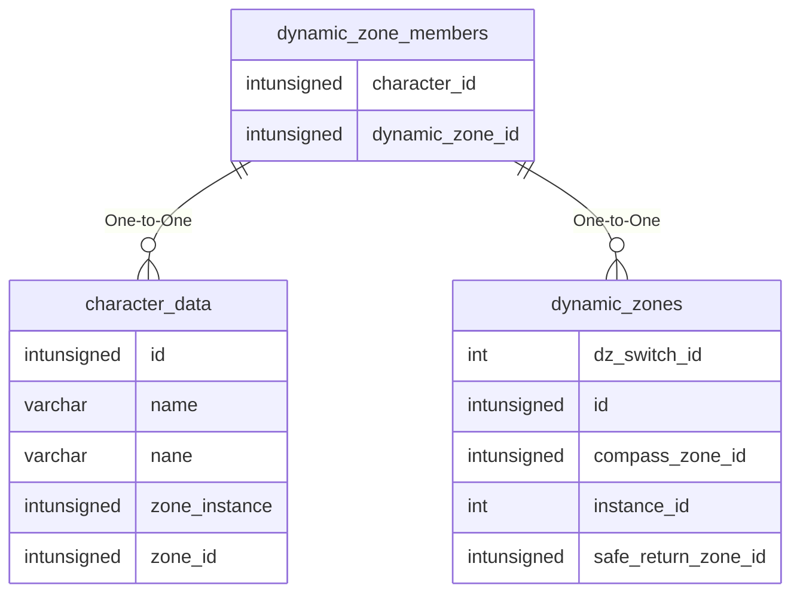

# dynamic_zone_members

## Relationships

| Relationship Type | Local Key | Relates to Table | Foreign Key |
| :--- | :--- | :--- | :--- |
| One-to-One | character_id | [character_data](../../schema/characters/character_data.md) | id |
| One-to-One | dynamic_zone_id | [dynamic_zones](../../schema/tasks/shared_task_dynamic_zones.md) | id |

## Schema

| Column | Data Type | Description |
| :--- | :--- | :--- |
| id | int | Unique Dynamic Zone Member Identifier |
| dynamic_zone_id | int | [Dynamic Zone Identifier](dynamic_zones.md) |
| character_id | int | [Character Identifier](../../schema/characters/character_data.md) |

