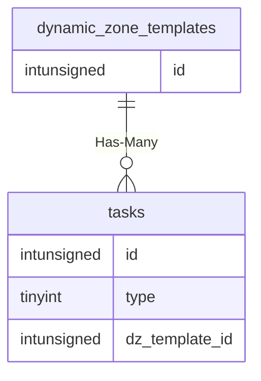

# dynamic_zone_templates

!!! info
	This page was last generated 2024.02.07

## Relationship Diagram(s)

## Relationships

| Relationship Type | Local Key | Relates to Table | Foreign Key |
| :--- | :--- | :--- | :--- |
| Has-Many | id | [tasks](../../schema/tasks/tasks.md) | dz_template_id |

## Schema

| Column | Data Type | Description |
| :--- | :--- | :--- |
| id | int | Dynamic Zone Template Unique Identifier |
| zone_id | int | [Dynamic Zone Template Zone Identifier](../../../../server/zones/zone-list) |
| zone_version | int | Zone Version |
| name | varchar | Dynamic Zone Template Name |
| min_players | int | Minimum Players |
| max_players | int | Maximum Players |
| duration_seconds | int | Duration in Seconds |
| dz_switch_id | int | [Dynamic Zone Switch Identifier](../../schema/doors/doors.md) |
| compass_zone_id | int | [Compass Zone Identifier](../../../../server/zones/zone-list) |
| compass_x | float | Compass X Coordinate |
| compass_y | float | Compass Y Coordinate |
| compass_z | float | Compass Z Coordinatet |
| return_zone_id | int | [Return Zone Identifier](../../../../server/zones/zone-list) |
| return_x | float | Return X Coordinate |
| return_y | float | Return Y Coordinate |
| return_z | float | Return Z Coordinate |
| return_h | float | Return Heading Coordinate |
| override_zone_in | tinyint | Override Zone In: 0 = False, 1 = True |
| zone_in_x | float | Zone In X Coordinate |
| zone_in_y | float | Zone In Y Coordinate |
| zone_in_z | float | Zone In Z Coordinate |
| zone_in_h | float | Zone In Heading Coordinate |

