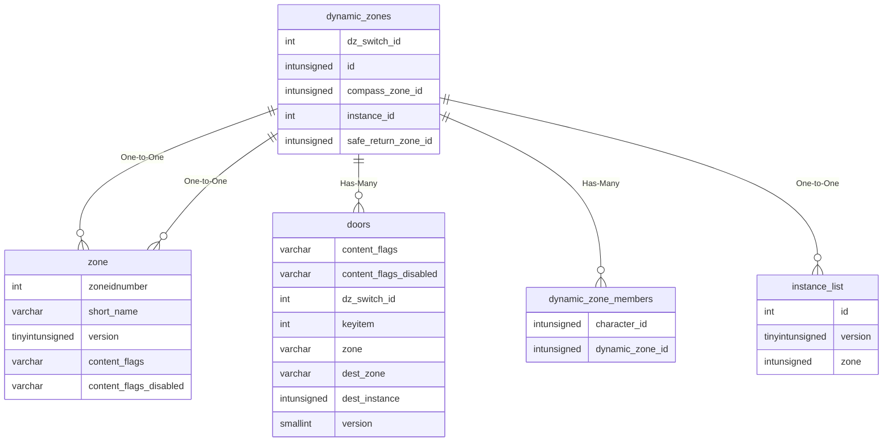

# dynamic_zones

## Relationships

| Relationship Type | Local Key | Relates to Table | Foreign Key |
| :--- | :--- | :--- | :--- |
| One-to-One | compass_zone_id | [zone](../../schema/zone/zone.md) | zoneidnumber |
| Has-Many | dz_switch_id | [doors](../../schema/doors/doors.md) | dz_switch_id |
| Has-Many | id | [dynamic_zone_members](../../schema/dynamic-zones/dynamic_zone_members.md) | dynamic_zone_id |
| One-to-One | instance_id | [instance_list](../../schema/instances/instance_list.md) | id |
| One-to-One | safe_return_zone_id | [zone](../../schema/zone/zone.md) | zoneidnumber |

## Schema

| Column | Data Type | Description |
| :--- | :--- | :--- |
| id | int | Unique Dynamic Zone Identifier |
| instance_id | int | [Instance Identifier](../../schema/instances/instance_list.md) |
| type | tinyint | Type |
| uuid | varchar | UUID |
| name | varchar | Name |
| leader_id | int | [Leader Character Identifier](../../schema/characters/character_data.md) |
| min_players | int | Minimum Players |
| max_players | int | Maximum Players |
| dz_switch_id | int | Dynamic Zone Switch Identifier](../../schema/doors/doors.md) |
| compass_zone_id | int | [Compass Zone Identifier](../../../../server/zones/zone-list) |
| compass_x | float | Compass X Coordinate |
| compass_y | float | Compass Y Coordinate |
| compass_z | float | Compass Z Coordinate |
| safe_return_zone_id | int | [Safe Return Zone Identifier](../../../../server/zones/zone-list) |
| safe_return_x | float | Safe Return X Coordinate |
| safe_return_y | float | Safe Return Y Coordinate |
| safe_return_z | float | Safe Return Z Coordinate |
| safe_return_heading | float | Safe Return Heading Coordinate |
| zone_in_x | float | Zone In X Coordinate |
| zone_in_y | float | Zone In Y Coordinate |
| zone_in_z | float | Zone In Z Coordinate |
| zone_in_heading | float | Zone In Heading Coordinate |
| has_zone_in | tinyint | Has Zone In: 0 = False, 1 = True |

