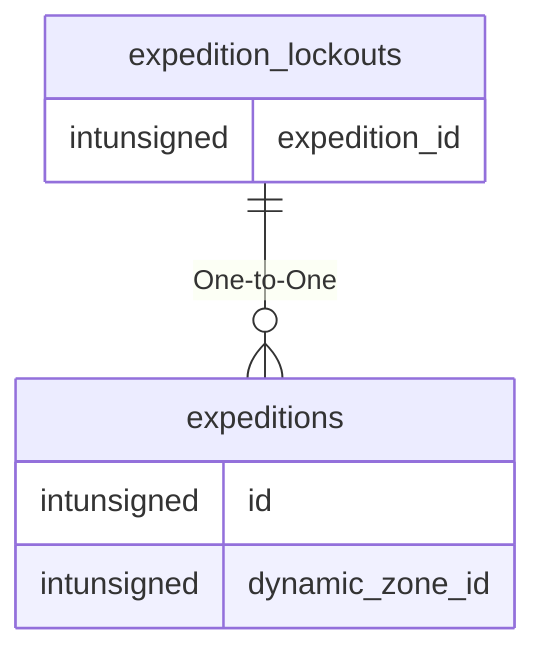

# expedition_lockouts

## Relationships

| Relationship Type | Local Key | Relates to Table | Foreign Key |
| :--- | :--- | :--- | :--- |
| One-to-One | expedition_id | [expeditions](../../schema/expeditions/expeditions.md) | id |

## Schema

| Column | Data Type | Description |
| :--- | :--- | :--- |
| id | int | Unique Expedition Lockout Identifier |
| expedition_id | int | [Expedition Identifier](expeditions.md) |
| event_name | varchar | Event Name |
| expire_time | datetime | Expire Time |
| duration | int | Duration in Seconds |
| from_expedition_uuid | varchar | From Expedition UUID |

