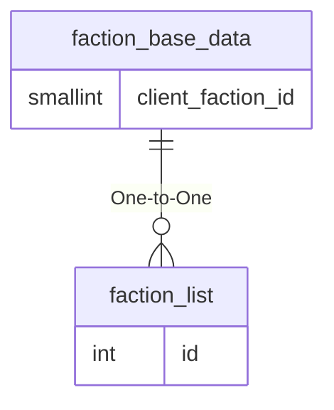

# faction_base_data

## Relationships

| Relationship Type | Local Key | Relates to Table | Foreign Key |
| :--- | :--- | :--- | :--- |
| One-to-One | client_faction_id | [faction_list](../../schema/factions/faction_list.md) | id |

## Schema

| Column | Data Type | Description |
| :--- | :--- | :--- |
| client_faction_id | smallint | [Client Faction Identifier](faction_list.md) |
| min | smallint | Minimum Faction |
| max | smallint | Maximum Faction |
| unk_hero1 | smallint | Unknown |
| unk_hero2 | smallint | Unknown |
| unk_hero3 | smallint | Unknown |

