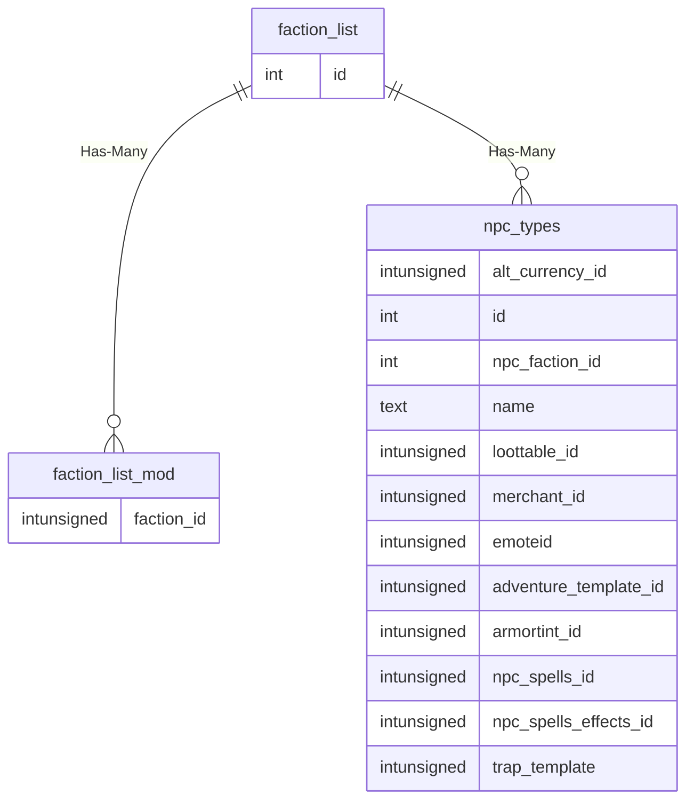

# faction_list

!!! info
	This page was last generated 2024.02.07

## Relationship Diagram(s)

## Relationships

| Relationship Type | Local Key | Relates to Table | Foreign Key |
| :--- | :--- | :--- | :--- |
| Has-Many | id | [faction_list_mod](../../schema/factions/faction_list_mod.md) | faction_id |
| Has-Many | id | [npc_types](../../schema/npcs/npc_types.md) | npc_faction_id |

## Schema

| Column | Data Type | Description |
| :--- | :--- | :--- |
| id | int | Unique Faction Identifier |
| name | varchar | Name |
| base | smallint | Base |

