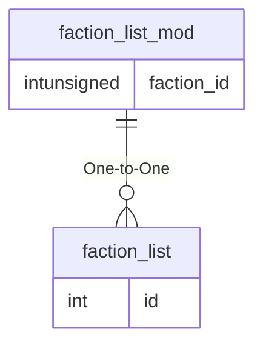

# faction_list_mod

## Relationships

| Relationship Type | Local Key | Relates to Table | Foreign Key |
| :--- | :--- | :--- | :--- |
| One-to-One | faction_id | [faction_list](../../schema/factions/faction_list.md) | id |

## Schema

| Column | Data Type | Description |
| :--- | :--- | :--- |
| id | int | Unique Faction List Modifier Identifier |
| faction_id | int | [Faction Identifier](faction_list.md) |
| mod | smallint | Modifier |
| mod_name | varchar | Modifier Name: r# = [Race Identifier](../../../../server/npc/race-list), c# = [Class Identifier](../../../../server/player/class-list), d# = [Deity Identifier](../../../../server/player/deity-list) |

