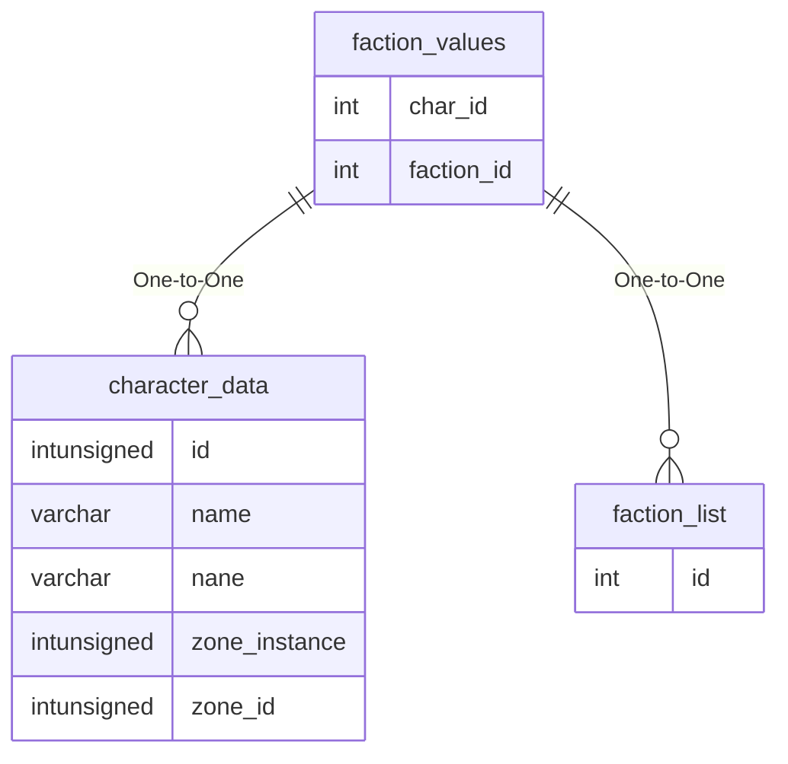

# faction_values

## Relationships

| Relationship Type | Local Key | Relates to Table | Foreign Key |
| :--- | :--- | :--- | :--- |
| One-to-One | char_id | [character_data](../../schema/characters/character_data.md) | id |
| One-to-One | faction_id | [faction_list](../../schema/factions/faction_list.md) | id |

## Schema

| Column | Data Type | Description |
| :--- | :--- | :--- |
| char_id | int | [Character Identifier](../../schema/characters/character_data.md) |
| faction_id | int | [Faction Identifier](faction_list.md) |
| current_value | smallint | Current Value |
| temp | tinyint | Temporary: 0 = False, 1 = True |

