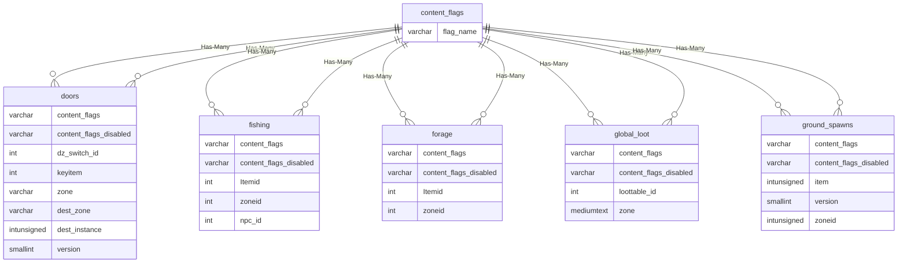
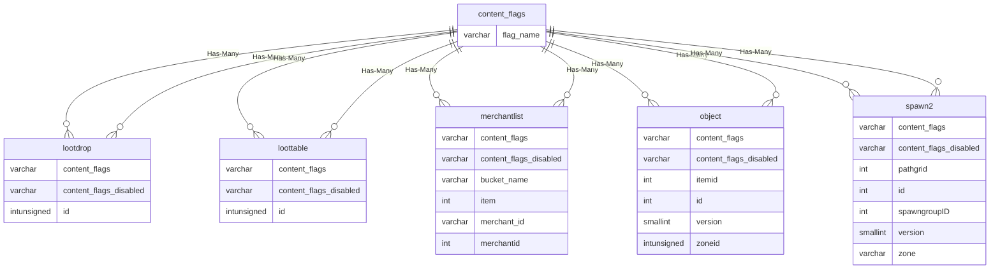
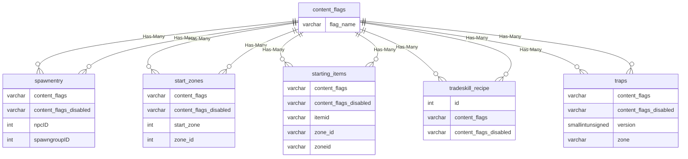
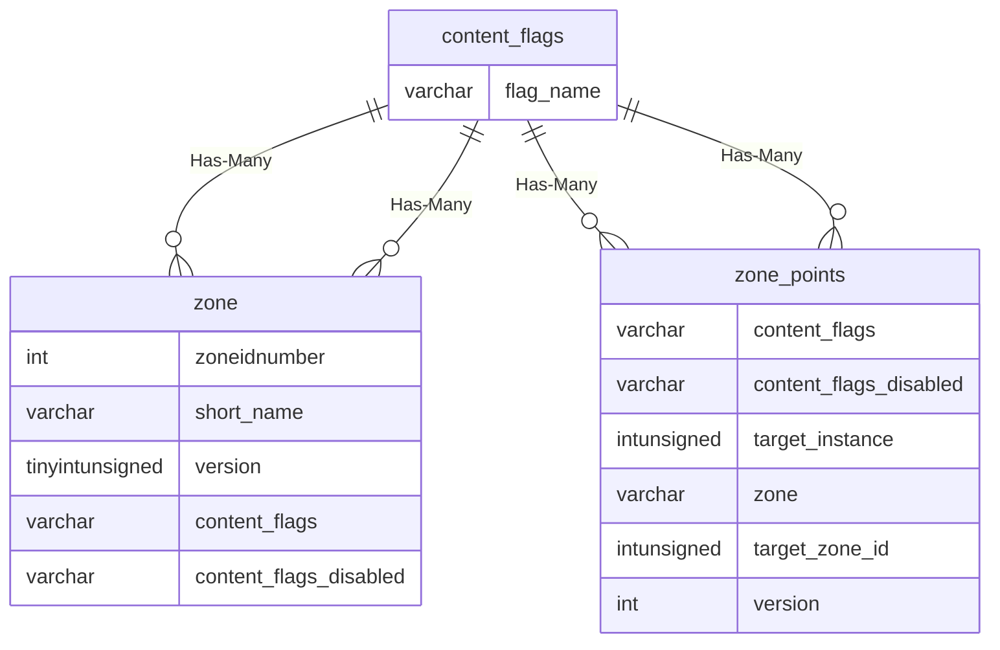

# content_flags

## Relationships

| Relationship Type | Local Key | Relates to Table | Foreign Key |
| :--- | :--- | :--- | :--- |
| Has-Many | flag_name | [doors](../../schema/doors/doors.md) | content_flags |
| Has-Many | flag_name | [doors](../../schema/doors/doors.md) | content_flags_disabled |
| Has-Many | flag_name | [fishing](../../schema/tradeskills/fishing.md) | content_flags |
| Has-Many | flag_name | [fishing](../../schema/tradeskills/fishing.md) | content_flags_disabled |
| Has-Many | flag_name | [forage](../../schema/tradeskills/forage.md) | content_flags |
| Has-Many | flag_name | [forage](../../schema/tradeskills/forage.md) | content_flags_disabled |
| Has-Many | flag_name | [global_loot](../../schema/loot/global_loot.md) | content_flags |
| Has-Many | flag_name | [global_loot](../../schema/loot/global_loot.md) | content_flags_disabled |
| Has-Many | flag_name | [ground_spawns](../../schema/ground-spawns/ground_spawns.md) | content_flags |
| Has-Many | flag_name | [ground_spawns](../../schema/ground-spawns/ground_spawns.md) | content_flags_disabled |
| Has-Many | flag_name | [lootdrop](../../schema/loot/lootdrop.md) | content_flags |
| Has-Many | flag_name | [lootdrop](../../schema/loot/lootdrop.md) | content_flags_disabled |
| Has-Many | flag_name | [loottable](../../schema/loot/loottable.md) | content_flags |
| Has-Many | flag_name | [loottable](../../schema/loot/loottable.md) | content_flags_disabled |
| Has-Many | flag_name | [merchantlist](../../schema/merchants/merchantlist.md) | content_flags |
| Has-Many | flag_name | [merchantlist](../../schema/merchants/merchantlist.md) | content_flags_disabled |
| Has-Many | flag_name | [object](../../schema/objects/object.md) | content_flags |
| Has-Many | flag_name | [object](../../schema/objects/object.md) | content_flags_disabled |
| Has-Many | flag_name | [spawn2](../../schema/spawns/spawn2.md) | content_flags |
| Has-Many | flag_name | [spawn2](../../schema/spawns/spawn2.md) | content_flags_disabled |
| Has-Many | flag_name | [spawnentry](../../schema/spawns/spawnentry.md) | content_flags |
| Has-Many | flag_name | [spawnentry](../../schema/spawns/spawnentry.md) | content_flags_disabled |
| Has-Many | flag_name | [start_zones](../../schema/admin/start_zones.md) | content_flags |
| Has-Many | flag_name | [start_zones](../../schema/admin/start_zones.md) | content_flags_disabled |
| Has-Many | flag_name | [starting_items](../../schema/admin/starting_items.md) | content_flags |
| Has-Many | flag_name | [starting_items](../../schema/admin/starting_items.md) | content_flags_disabled |
| Has-Many | flag_name | [tradeskill_recipe](../../schema/tradeskills/tradeskill_recipe.md) | content_flags |
| Has-Many | flag_name | [tradeskill_recipe](../../schema/tradeskills/tradeskill_recipe.md) | content_flags_disabled |
| Has-Many | flag_name | [traps](../../schema/traps/traps.md) | content_flags |
| Has-Many | flag_name | [traps](../../schema/traps/traps.md) | content_flags_disabled |
| Has-Many | flag_name | [zone](../../schema/zone/zone.md) | content_flags |
| Has-Many | flag_name | [zone](../../schema/zone/zone.md) | content_flags_disabled |
| Has-Many | flag_name | [zone_points](../../schema/zone/zone_points.md) | content_flags |
| Has-Many | flag_name | [zone_points](../../schema/zone/zone_points.md) | content_flags_disabled |

## Schema

| Column | Data Type | Description |
| :--- | :--- | :--- |
| id | int | Unique Flag Identifier |
| flag_name | varchar | Flag Name |
| enabled | tinyint | Enabled: 0 = False, 1 = True |
| notes | text | Notes |

