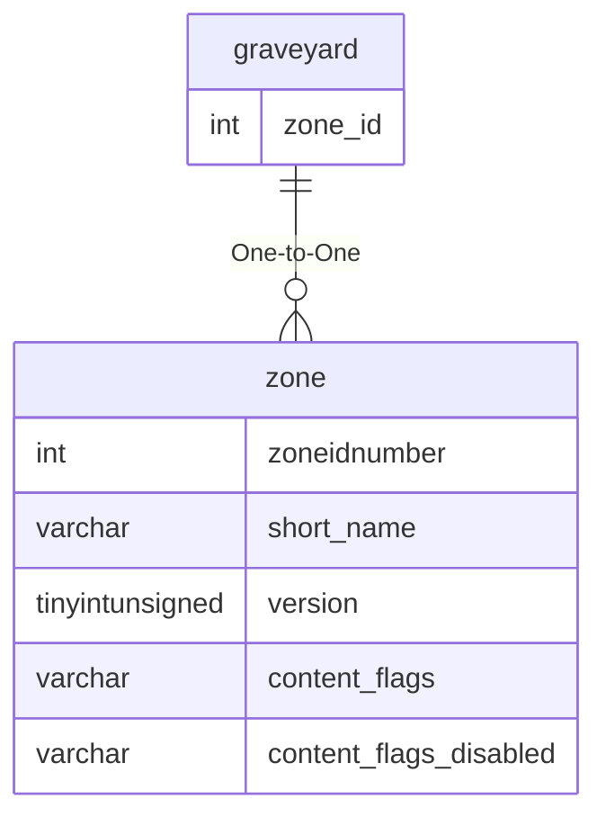

# graveyard

## Relationships

| Relationship Type | Local Key | Relates to Table | Foreign Key |
| :--- | :--- | :--- | :--- |
| One-to-One | zone_id | [zone](../../schema/zone/zone.md) | zoneidnumber |

## Schema

| Column | Data Type | Description |
| :--- | :--- | :--- |
| id | int | Unique Graveyard Identifier |
| zone_id | int | [Zone Identifier](../../../../server/zones/zone-list) |
| x | float | X Coordinate |
| y | float | Y Coordinate |
| z | float | Z Coordinate |
| heading | float | Heading Coordinate |

