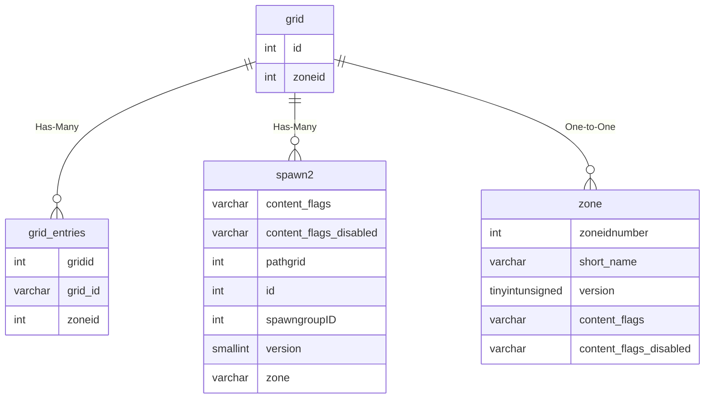

# grid

## Relationships

| Relationship Type | Local Key | Relates to Table | Foreign Key |
| :--- | :--- | :--- | :--- |
| Has-Many | id | [grid_entries](../../schema/grids/grid_entries.md) | gridid |
| Has-Many | id | [spawn2](../../schema/spawns/spawn2.md) | pathgrid |
| One-to-One | zoneid | [zone](../../schema/zone/zone.md) | zoneidnumber |

## Schema

| Column | Data Type | Description |
| :--- | :--- | :--- |
| id | int | Unique Grid Identifier |
| zoneid | int | [Zone Identifier](../../../../server/zones/zone-list) |
| type | int | [Wander Type](../../../../server/npc/spawns/wander-types) |
| type2 | int | [Pause Type](../../../../server/npc/spawns/pause-types) |

