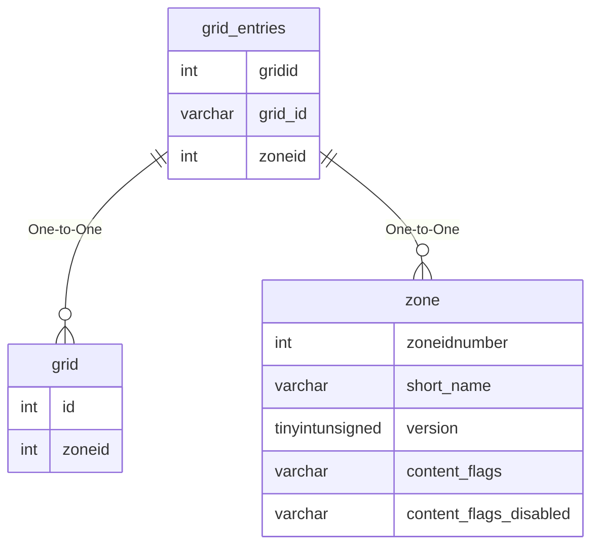

# grid_entries

## Relationships

| Relationship Type | Local Key | Relates to Table | Foreign Key |
| :--- | :--- | :--- | :--- |
| One-to-One | grid_id | [grid](../../schema/grids/grid.md) | id |
| One-to-One | zoneid | [zone](../../schema/zone/zone.md) | zoneidnumber |

## Schema

| Column | Data Type | Description |
| :--- | :--- | :--- |
| gridid | int | [Grid Identifier](grid.md) |
| zoneid | int | [Zone Identifier](../../../../server/zones/zone-list) |
| number | int | Waypoint Identifier |
| x | float | X Coordinate |
| y | float | Y Coordinate |
| z | float | Z Coordinate |
| heading | float | Heading Coordinate |
| pause | int | Pause in Seconds |
| centerpoint | tinyint | Center Point: 0 = False, 1 = True |

