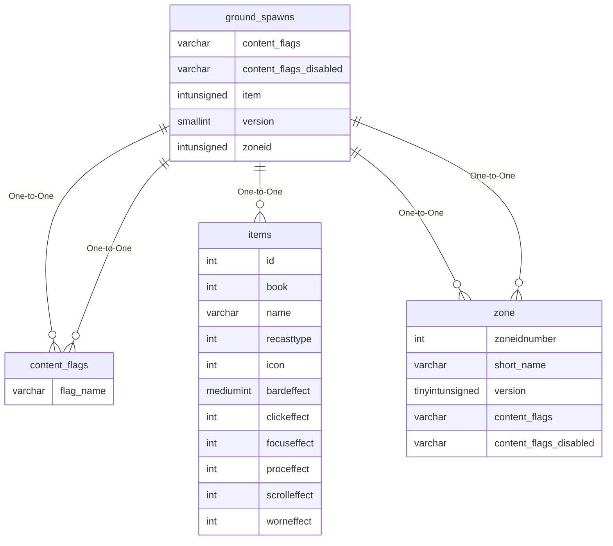

# ground_spawns

## Relationships

| Relationship Type | Local Key | Relates to Table | Foreign Key |
| :--- | :--- | :--- | :--- |
| One-to-One | content_flags | [content_flags](../../schema/flagging/content_flags.md) | flag_name |
| One-to-One | content_flags_disabled | [content_flags](../../schema/flagging/content_flags.md) | flag_name |
| One-to-One | item | [items](../../schema/items/items.md) | id |
| One-to-One | version | [zone](../../schema/zone/zone.md) | version |
| One-to-One | zoneid | [zone](../../schema/zone/zone.md) | zoneidnumber |

## Schema

| Column | Data Type | Description |
| :--- | :--- | :--- |
| id | int | Unique Ground Spawn Identifier |
| zoneid | int | [Zone Identifier](../../../../server/zones/zone-list) |
| version | smallint | Version: -1 For All |
| max_x | float | Maximum X Coordinate |
| max_y | float | Maximum Y Coordinate |
| max_z | float | Maximum Z Coordinate |
| min_x | float | Minimum X Coordinate |
| min_y | float | Minimum Y Coordinate |
| heading | float | Heading Coordinate |
| name | varchar | Name |
| item | int | [Item Identifier](../../schema/items/items.md) |
| max_allowed | int | Max Allowed |
| comment | varchar | Comment |
| respawn_timer | int | Respawn Timer in Seconds |
| fix_z | tinyint |  |
| min_expansion | tinyint | [Minimum Expansion](../../../../server/operation/expansion-list) |
| max_expansion | tinyint | [Maximum Expansion](../../../../server/operation/expansion-list) |
| content_flags | varchar | Content Flags Required to be Enabled |
| content_flags_disabled | varchar | Content Flags Required to be Disabled |

