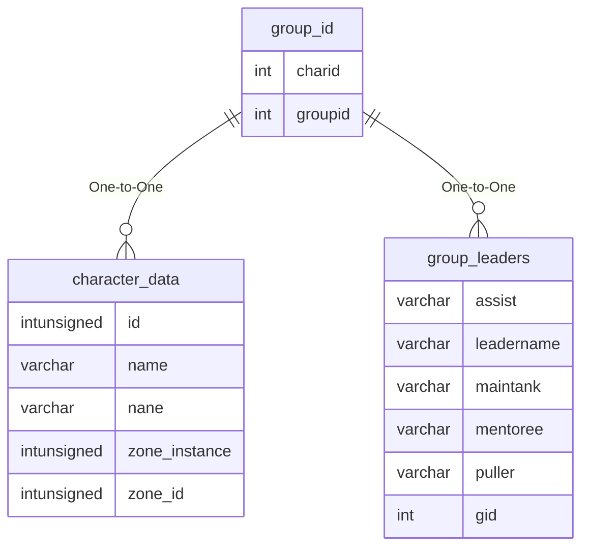

# group_id

## Relationships

| Relationship Type | Local Key | Relates to Table | Foreign Key |
| :--- | :--- | :--- | :--- |
| One-to-One | charid | [character_data](../../schema/characters/character_data.md) | id |
| One-to-One | groupid | [group_leaders](../../schema/groups/group_leaders.md) | gid |

## Schema

| Column | Data Type | Description |
| :--- | :--- | :--- |
| groupid | int | Unique Group Identifier |
| charid | int | [Character Identifier](../../schema/characters/character_data.md) |
| name | varchar | Name |
| ismerc | tinyint | Is Mercenary: 0 = False, 1 = True |

