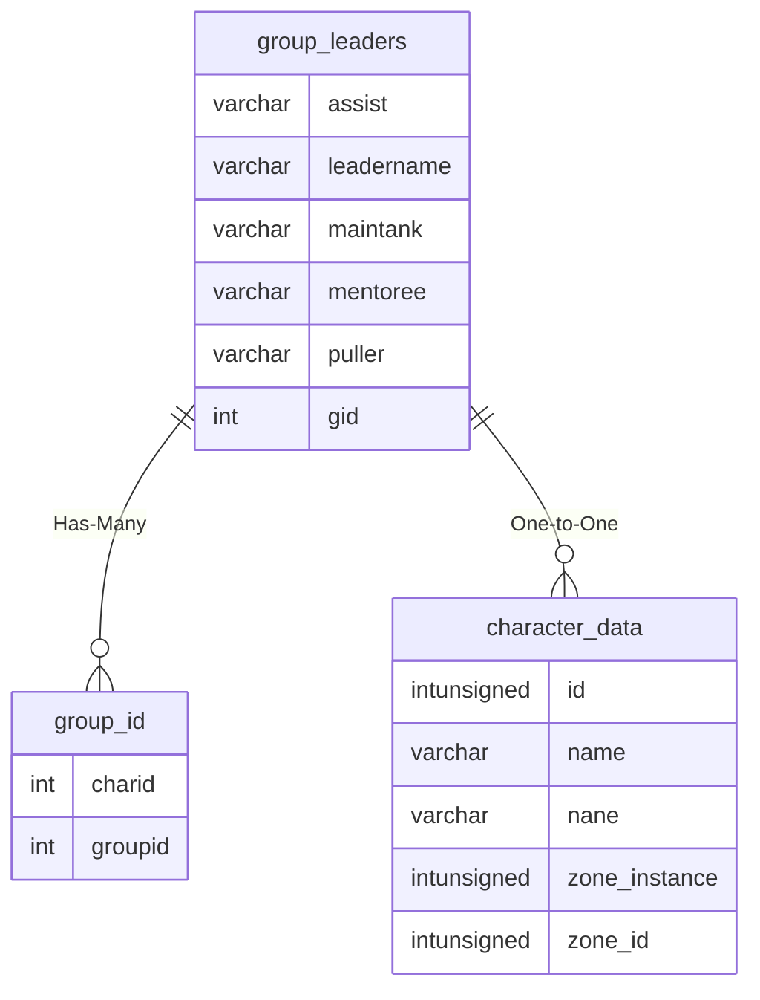

# group_leaders

## Relationships

| Relationship Type | Local Key | Relates to Table | Foreign Key |
| :--- | :--- | :--- | :--- |
| Has-Many | gid | [group_id](../../schema/groups/group_id.md) | groupid |
| One-to-One | leadername | [character_data](../../schema/characters/character_data.md) | name |

## Schema

| Column | Data Type | Description |
| :--- | :--- | :--- |
| gid | int | [Group Identifier](group_id.md) |
| leadername | varchar | Leader Name |
| marknpc | varchar | Mark NPC: 0 = False, 1 = True |
| leadershipaa | tinyblob | Leadership AA |
| maintank | varchar | Main Tank: 0 = False, 1 = True |
| assist | varchar | Assist: 0 = False, 1 = True |
| puller | varchar | Puller: 0 = False, 1 = True |
| mentoree | varchar | Mentoree: 0 = False, 1 = True |
| mentor_percent | int | Main Tank: 0 = None, 100 = Max |

