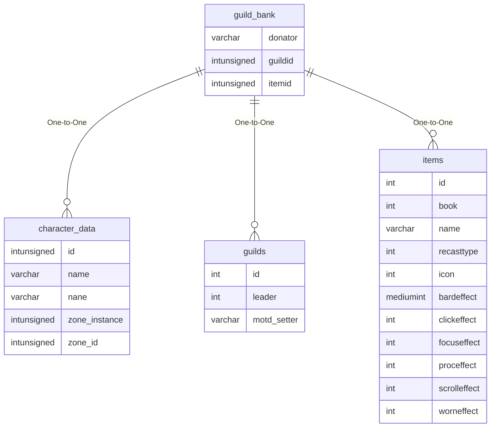

# guild_bank

## Relationships

| Relationship Type | Local Key | Relates to Table | Foreign Key |
| :--- | :--- | :--- | :--- |
| One-to-One | donator | [character_data](../../schema/characters/character_data.md) | name |
| One-to-One | guildid | [guilds](../../schema/guilds/guilds.md) | id |
| One-to-One | itemid | [items](../../schema/items/items.md) | id |

## Schema

| Column | Data Type | Description |
| :--- | :--- | :--- |
| guildid | int | [Guild Identifier](guilds.md) |
| area | tinyint | Area |
| slot | int | Slot Identifier |
| itemid | int | [Item Identifier](../../schema/items/items.md) |
| qty | int | Quantity |
| donator | varchar | [Character Identifier](../../schema/characters/character_data.md) |
| permissions | tinyint | Permissions |
| whofor | varchar | Who For |

