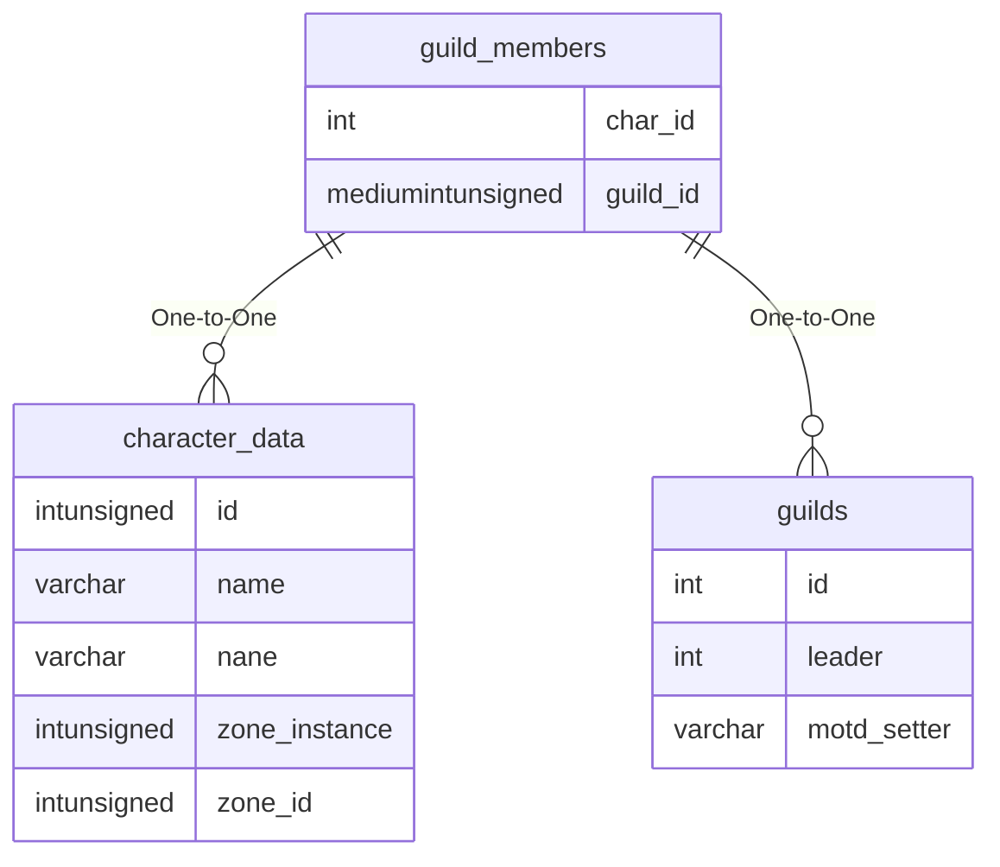

# guild_members

## Relationships

| Relationship Type | Local Key | Relates to Table | Foreign Key |
| :--- | :--- | :--- | :--- |
| One-to-One | char_id | [character_data](../../schema/characters/character_data.md) | id |
| One-to-One | guild_id | [guilds](../../schema/guilds/guilds.md) | id |

## Schema

| Column | Data Type | Description |
| :--- | :--- | :--- |
| char_id | int | [Character Identifier](../../schema/characters/character_data.md) |
| guild_id | mediumint | [Guild Identifier](guilds.md) |
| rank | tinyint | [Rank](../../../../server/player/guild-ranks) |
| tribute_enable | tinyint | Tribute Enable: 0 = False, 1 = True |
| total_tribute | int | Total Tribute |
| last_tribute | int | Last Tribute |
| banker | tinyint | Banked: 0 = False, 1 = True |
| public_note | text | Public Note |
| alt | tinyint | Alt: 0 = False, 1 = True |
| online | tinyint |  |

