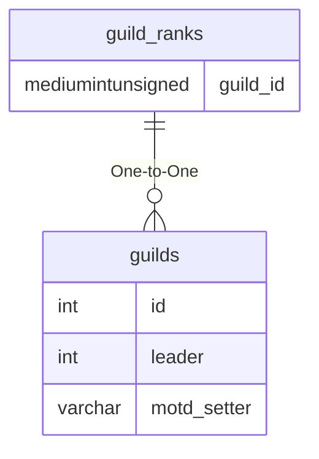

# guild_ranks

!!! info
	This page was last generated 2024.02.07

## Relationship Diagram(s)

## Relationships

| Relationship Type | Local Key | Relates to Table | Foreign Key |
| :--- | :--- | :--- | :--- |
| One-to-One | guild_id | [guilds](../../schema/guilds/guilds.md) | id |

## Schema

| Column | Data Type | Description |
| :--- | :--- | :--- |
| guild_id | mediumint | [Guild Identifier](guilds.md) |
| rank | tinyint | Rank Identifier |
| title | varchar | Title |
| can_hear | tinyint | Can Hear: 0 = False, 1 = True |
| can_speak | tinyint | Can Speak: 0 = False, 1 = True |
| can_invite | tinyint | Can Invite: 0 = False, 1 = True |
| can_remove | tinyint | Can Remove: 0 = False, 1 = True |
| can_promote | tinyint | Can Promote: 0 = False, 1 = True |
| can_demote | tinyint | Can Demote: 0 = False, 1 = True |
| can_motd | tinyint | Can MOTD: 0 = False, 1 = True |
| can_warpeace | tinyint | Can War Peace: 0 = False, 1 = True |

