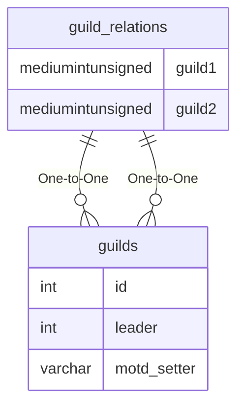

# guild_relations

## Relationships

| Relationship Type | Local Key | Relates to Table | Foreign Key |
| :--- | :--- | :--- | :--- |
| One-to-One | guild1 | [guilds](../../schema/guilds/guilds.md) | id |
| One-to-One | guild2 | [guilds](../../schema/guilds/guilds.md) | id |

## Schema

| Column | Data Type | Description |
| :--- | :--- | :--- |
| guild1 | mediumint | [Unique Guild Identifier 1](guilds.md) |
| guild2 | mediumint | [Unique Guild Identifier 2](guilds.md) |
| relation | tinyint | Relation |

