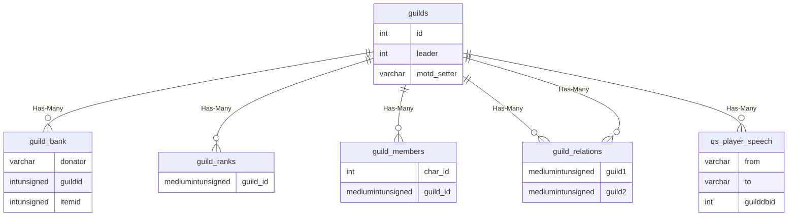
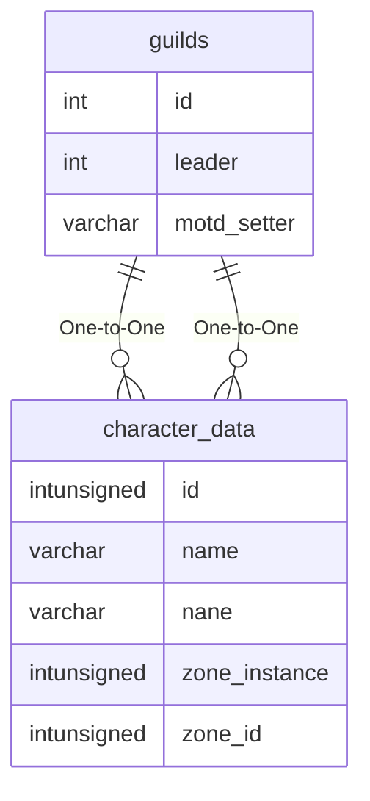

# guilds

## Relationships

| Relationship Type | Local Key | Relates to Table | Foreign Key |
| :--- | :--- | :--- | :--- |
| Has-Many | id | [guild_bank](../../schema/guilds/guild_bank.md) | guildid |
| Has-Many | id | [guild_ranks](../../schema/guilds/guild_ranks.md) | guild_id |
| Has-Many | id | [guild_members](../../schema/views/vw_guild_members.md) | guild_id |
| Has-Many | id | [guild_relations](../../schema/guilds/guild_relations.md) | guild1 |
| Has-Many | id | [guild_relations](../../schema/guilds/guild_relations.md) | guild2 |
| Has-Many | id | [qs_player_speech](../../schema/query-server/qs_player_speech.md) | guilddbid |
| One-to-One | leader | [character_data](../../schema/characters/character_data.md) | id |
| One-to-One | motd_setter | [character_data](../../schema/characters/character_data.md) | name |

## Schema

| Column | Data Type | Description |
| :--- | :--- | :--- |
| id | int | Unique Guild Identifier |
| name | varchar | Name |
| leader | int | [Character Identifier](../../schema/characters/character_data.md) |
| minstatus | smallint | [Minimum Status](../../../../server/player/status-levels) |
| motd | text | Message of the Day |
| tribute | int | Tribute |
| motd_setter | varchar | [Character Identifier](../../schema/characters/character_data.md) |
| channel | varchar | Channel |
| url | varchar | Website URL |
| favor | int |  |

