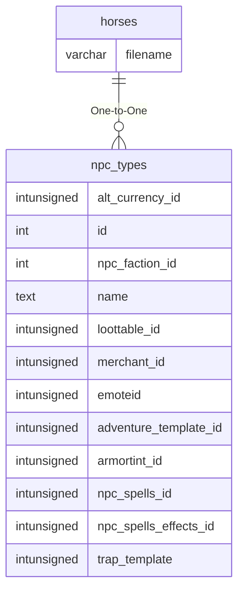

# horses

!!! info
	This page was last generated 2024.02.07

## Relationship Diagram(s)

## Relationships

| Relationship Type | Local Key | Relates to Table | Foreign Key |
| :--- | :--- | :--- | :--- |
| One-to-One | filename | [npc_types](../../schema/npcs/npc_types.md) | name |

## Schema

| Column | Data Type | Description |
| :--- | :--- | :--- |
| id | int | Unique Horse Identifier |
| filename | varchar | [NPC Type Name](../../schema/npcs/npc_types.md) |
| race | smallint | [Race](../../../../server/npc/race-list) |
| gender | tinyint | [Gender](../../../../server/npc/genders) |
| texture | tinyint | [Texture](../../../../server/npc/textures) |
| mountspeed | float | Mount Run Speed |
| notes | varchar | Notes |

