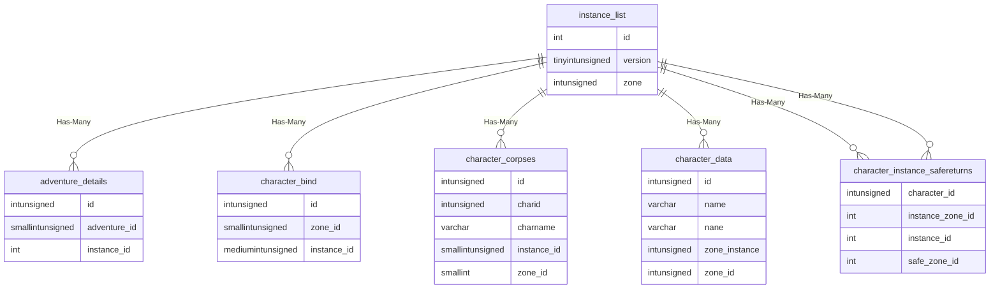
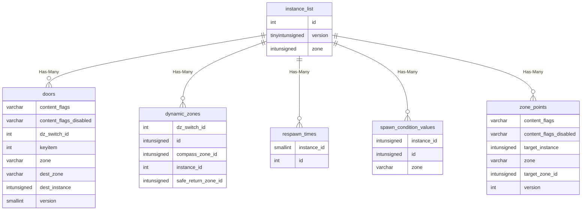
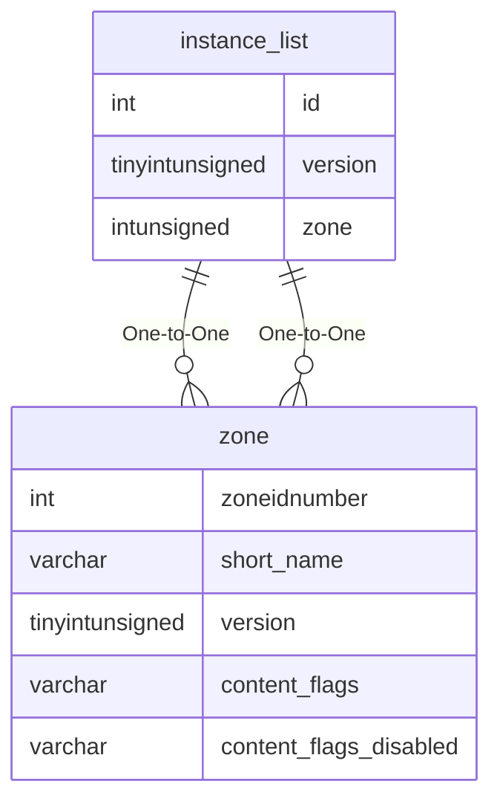

# instance_list

## Relationships

| Relationship Type | Local Key | Relates to Table | Foreign Key |
| :--- | :--- | :--- | :--- |
| Has-Many | id | [adventure_details](../../schema/adventures/adventure_details.md) | instance_id |
| Has-Many | id | [character_bind](../../schema/characters/character_bind.md) | instance_id |
| Has-Many | id | [character_corpses](../../schema/characters/character_corpses.md) | instance_id |
| Has-Many | id | [character_data](../../schema/characters/character_data.md) | zone_instance |
| Has-Many | id | [character_instance_safereturns](../../schema/characters/character_instance_safereturns.md) | instance_id |
| Has-Many | id | [character_instance_safereturns](../../schema/characters/character_instance_safereturns.md) | instance_zone_id |
| Has-Many | id | [doors](../../schema/doors/doors.md) | dest_instance |
| Has-Many | id | [dynamic_zones](../../schema/tasks/shared_task_dynamic_zones.md) | instance_id |
| Has-Many | id | [respawn_times](../../schema/spawns/respawn_times.md) | instance_id |
| Has-Many | id | [spawn_condition_values](../../schema/spawns/spawn_condition_values.md) | instance_id |
| Has-Many | id | [zone_points](../../schema/zone/zone_points.md) | target_instance |
| One-to-One | version | [zone](../../schema/zone/zone.md) | version |
| One-to-One | zone | [zone](../../schema/zone/zone.md) | zoneidnumber |

## Schema

| Column | Data Type | Description |
| :--- | :--- | :--- |
| id | int | Unique Instance Identifier |
| zone | int | [Zone Identifier](../../../../server/zones/zone-list) |
| version | tinyint | Version |
| is_global | tinyint | Is Global: 0 = False, 1 = True |
| start_time | int | Start Time UNIX Timestamp |
| duration | int | Duration in Seconds |
| never_expires | tinyint | Never Expires: 0 = False, 1 = True |
| notes | varchar |  |

