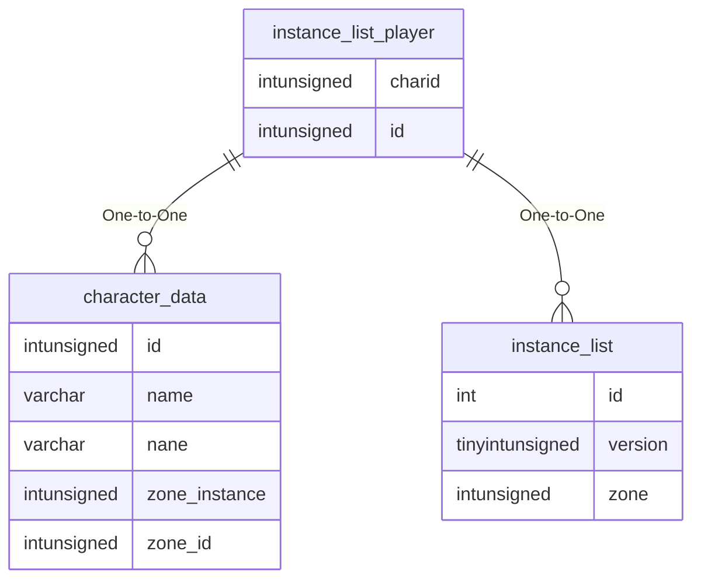

# instance_list_player

!!! info
	This page was last generated 2024.02.07

## Relationship Diagram(s)

## Relationships

| Relationship Type | Local Key | Relates to Table | Foreign Key |
| :--- | :--- | :--- | :--- |
| One-to-One | charid | [character_data](../../schema/characters/character_data.md) | id |
| One-to-One | id | [instance_list](../../schema/instances/instance_list.md) | id |

## Schema

| Column | Data Type | Description |
| :--- | :--- | :--- |
| id | int | [Instance Identifier](instance_list.md) |
| charid | int | [Character Identifier](../../schema/characters/character_data.md) |

